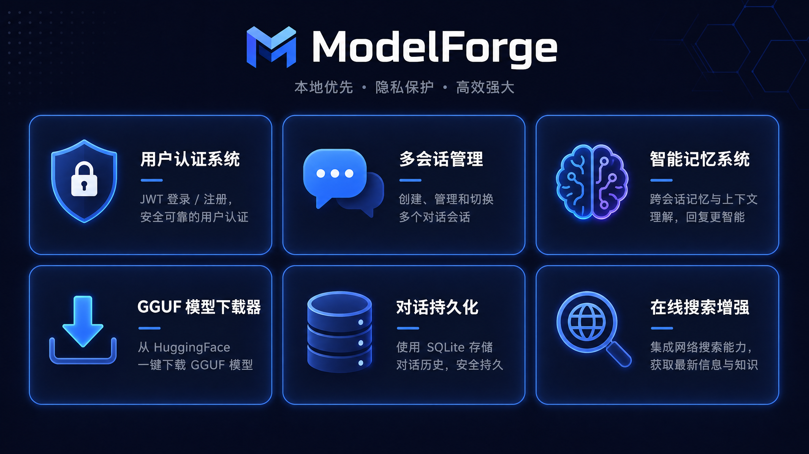
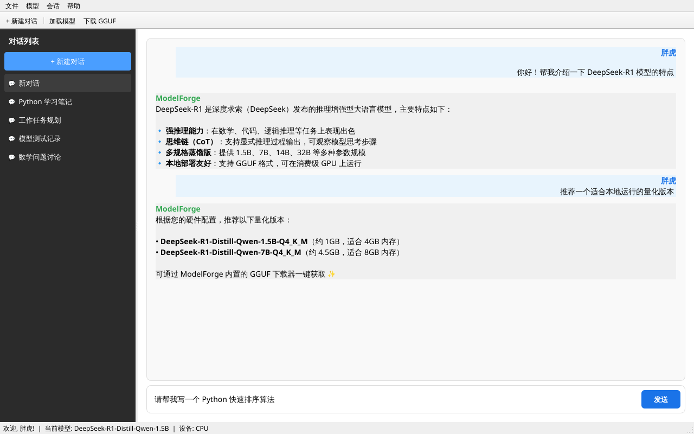
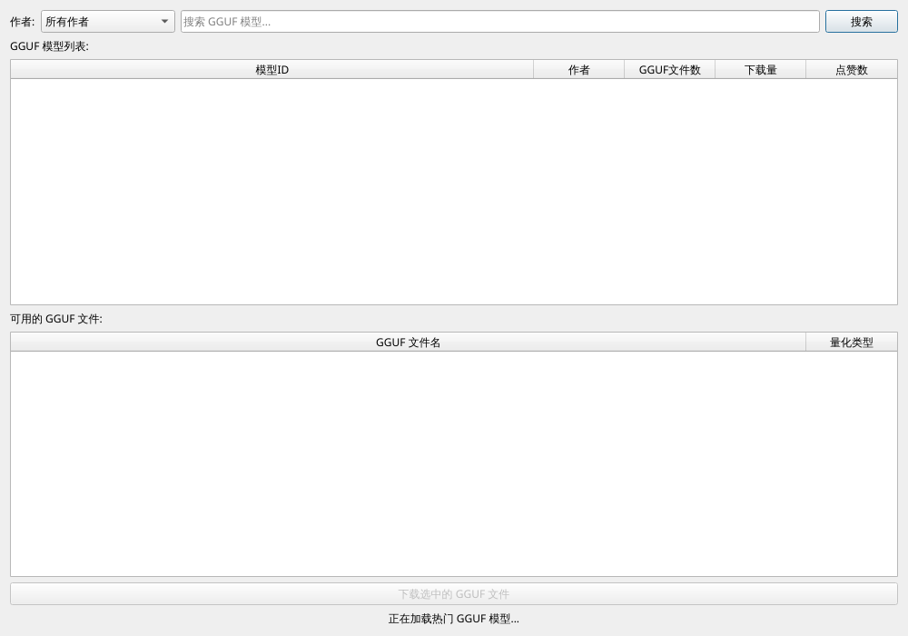
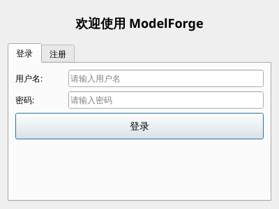

<div align="center">
  

  # ModelForge 2.0
  
  **本地大模型推理与训练平台 · 隐私安全 · 高效强大**

  [](https://www.python.org/)
  [](https://www.qt.io/qt-for-python)
  [](https://pytorch.org/)
  [](LICENSE)
</div>

<br>

ModelForge 2.0 是一个功能强大的**本地大模型推理平台**，专为 AI 开发者、研究者和对隐私有极高要求的用户设计。新版本带来了革命性的用户体验升级，实现了类似 ChatGPT 的多会话管理与智能记忆系统，让您在本地环境中也能享受顶级的 AI 交互体验。

---

## ✨ 核心特性



ModelForge 2.0 不仅是一个模型运行工具，更是一个完整的本地 AI 工作站：

| 🌟 核心功能 | 📝 详细说明 |
| :--- | :--- |
| **🔐 用户认证系统** | 内置 JWT 登录与注册机制，保障本地多用户使用时的隐私隔离。 |
| **💬 多会话管理** | 像 ChatGPT 一样创建、切换、重命名和删除多个独立对话会话。 |
| **🧠 智能记忆系统** | 自动提取用户偏好与事实，实现跨会话的记忆注入，让回复更懂你。 |
| **⬇️ GGUF 一键下载** | 内置模型下载器，支持从 HuggingFace 一键搜索并下载 GGUF 量化模型。 |
| **💾 对话持久化** | 采用 SQLite + SQLAlchemy，所有对话历史自动保存，随时无缝接续。 |
| **🌐 在线搜索增强** | 集成 Web Search 能力，模型可实时获取网络最新资讯增强回答。 |
| **⚙️ 多格式自适应** | 自动识别 `safetensors` 和 `gguf` 格式，智能切换底层推理引擎。 |

---

## 📸 界面展示

### 🎨 全新会话主界面
支持左侧会话列表管理，右侧富文本对话展示，底部快捷参数调整。


### ⬇️ GGUF 模型下载器
内置强大的模型检索工具，支持按作者筛选、查看文件大小与量化类型，一键下载到本地。


### 🔒 独立用户空间
首次启动需注册/登录，保护您的专属对话记录与模型偏好。
<div align="center">
  
</div>

---

## 🚀 快速开始

### 1. 环境准备
推荐使用 Conda 创建隔离的 Python 环境（要求 Python 3.10+）：

```bash
conda create -n modelForge python=3.10
conda activate modelForge
```

### 2. 克隆项目与安装依赖

```bash
# 克隆仓库
git clone https://github.com/yanzhao77/ModelForge.git
cd ModelForge

# 安装核心依赖
pip install -r requirements_new.txt
```

> **注意**：如需使用 GPU 加速，请根据您的 CUDA 版本安装对应的 PyTorch：
> `pip install torch==2.2.0+cu118 torchvision==0.17.0+cu118 torchaudio==2.2.0 --index-url https://mirror.sjtu.edu.cn/pytorch-wheels/cu118/`

### 3. 启动应用

新版本请使用 `main_session.py` 作为入口启动：

```bash
python main_session.py
```

### 4. 首次使用指南
1. **注册账户**：启动后在弹出的登录窗口点击“注册”创建本地账户。
2. **获取模型**：点击顶部菜单栏 `模型 -> 下载 GGUF 模型`，搜索并下载心仪的模型（如 `Qwen` 或 `DeepSeek`）。
3. **加载模型**：点击工具栏 `加载模型`，选择已下载的模型文件目录。
4. **开始对话**：在左侧新建对话，即可开始您的本地 AI 之旅！

---

## 🏗️ 技术架构

ModelForge 采用现代化的 Python 技术栈构建：

- **GUI 前端**：`PySide6` (Qt for Python) 提供流畅的跨平台图形界面。
- **推理引擎**：`PyTorch` + `Transformers` (处理 safetensors) / `llama-cpp-python` (处理 GGUF)。
- **数据持久化**：`SQLite` + `SQLAlchemy` ORM 框架管理用户、会话与记忆。
- **安全认证**：`PyJWT` + `passlib` (bcrypt) 实现 Token 签发与密码哈希。

### 📁 核心目录结构

```text
ModelForge/
├── main_session.py              # 🚀 2.0 新版程序入口
├── gui/                         # 🎨 图形界面组件
│   ├── SessionMainWindow.py     # 核心主窗口
│   ├── login_dialog.py          # 登录与注册模块
│   ├── session_sidebar.py       # 会话侧边栏管理
│   └── dialog/
│       └── gguf_download_dialog.py # GGUF 下载器
├── api/                         # ⚙️ 业务逻辑服务层
│   ├── auth_service.py          # 认证服务
│   ├── session_service.py       # 会话 CRUD 服务
│   └── memory_service.py        # 智能记忆提取服务
├── database/                    # 💾 数据库管理层
├── models/                      # 🗃️ SQLAlchemy 数据表模型
├── pytorch/                     # 🧠 底层模型推理封装
│   └── session_model_generate.py# 结合会话上下文的推理主逻辑
└── docs/                        # 📚 文档与截图资源
```

---

## 打包说明

如需将项目打包为独立的 Windows `.exe` 可执行文件，推荐使用 **Nuitka** 以获得更好的性能：

```bash
python -m nuitka --onefile --output-dir=build --mingw64 --standalone \
--module-parameter=torch-disable-jit=no --enable-plugin=pyqt6 \
--include-data-dir=.venv/Lib/site-packages/transformers=transformers \
--include-data-dir=.venv/Lib/site-packages/datasets=datasets \
--include-data-dir=.venv/Lib/site-packages/torch=torch \
--include-package=markdown --include-package=huggingface_hub \
--include-module=duckduckgo_search \
--windows-icon-from-ico=icon\logo.ico main_session.py
```

---

## 🤝 参与贡献

我们非常欢迎开发者参与到 ModelForge 的建设中来！
1. Fork 本仓库
2. 创建您的特性分支 (`git checkout -b feature/AmazingFeature`)
3. 提交您的修改 (`git commit -m 'Add some AmazingFeature'`)
4. 推送到分支 (`git push origin feature/AmazingFeature`)
5. 开启一个 Pull Request

## 📝 许可证

本项目仅供学习与研究使用，**禁止用于商业用途**。

---
<div align="center">
  <b>如果 ModelForge 对您有帮助，请考虑给项目点个 ⭐ Star！</b>
</div>
