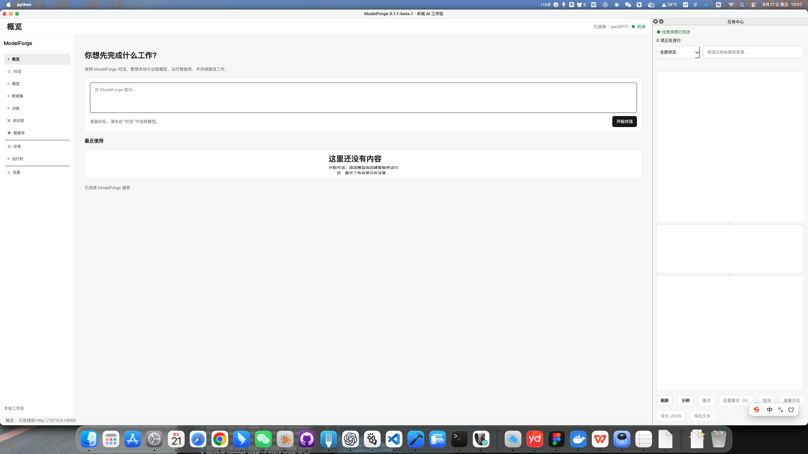
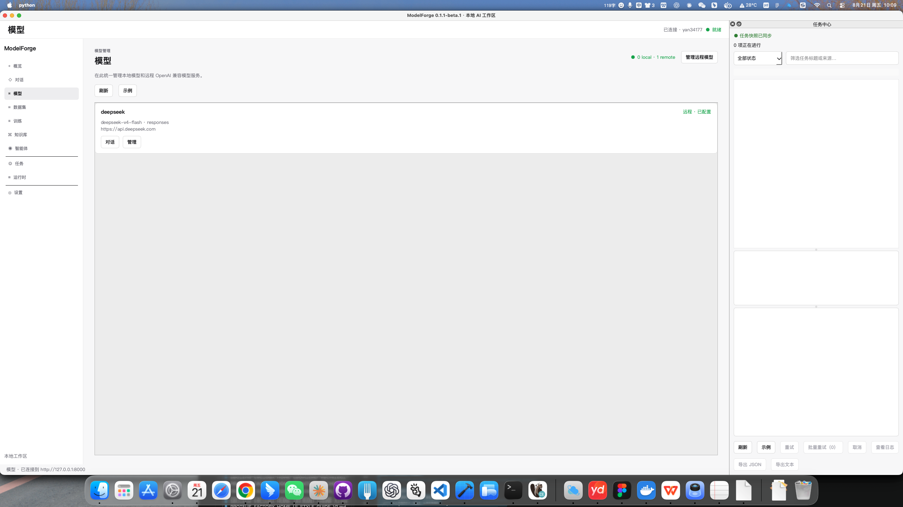

# ModelForge 3.x

> 本地优先的 AI Agent Runtime Platform —— 从模型管理、微调训练到 **Agent Run / Event / Tool / Policy / MCP / Scheduler / Multi-Agent / Composable Plugin** 的一站式平台。


基于 **FastAPI 后端 + PySide6 瘦客户端** 架构：后端承载全部业务逻辑（含 Agent Runtime），客户端只做展示与交互。

## 桌面端测试版（0.1.3-beta.1）

当前仓库已包含新版 macOS 桌面端测试版：默认使用简体中文，支持中文、English、日本語运行时切换；采用轻量侧边导航和对话优先工作区，并将**本地模型与远程 OpenAI 兼容模型服务统一收敛到“模型”页面**。远程服务默认使用 `/v1/responses`，也可切换到 `/v1/chat/completions`；API Key 仅在后端加密保存，客户端不会回显密钥。登录后，客户端会通过后端权威的模型就绪快照区分“可用、需要配置、配置待修复、服务不可用”四种状态；无可用模型时，首次使用向导只提供显式配置、验证与跳转，不会下载模型、创建会话、Agent Run 或训练任务。

| 概览工作区 | 统一模型管理 |
|---|---|
|  |  |

> 以上截图来自本机测试版实机预览。测试版已发布为 [v0.1.3-beta.1 Pre-release](https://github.com/yanzhao77/ModelForge/releases/tag/v0.1.3-beta.1)；本地打包与预发布资产规范见[桌面端测试版发布指南](docs/DESKTOP_TEST_RELEASE.md)。

## 功能一览

| 模块 | 说明 |
|------|------|
| 用户系统 | 注册/登录/改密码，JWT 认证，PBKDF2 密码哈希，用户数据隔离 |
| 会话/消息 | 多会话创建/切换/重命名/软删除，消息持久化，自动标题 |
| 跨会话记忆 | 关键词规则提取（偏好/事实）、搜索、重要性评分、上下文注入 |
| 模型管理 | 本地模型扫描/登记/删除、HF 搜索与后台下载（GGUF 等）；统一管理本地与远程模型服务、就绪状态和用户默认模型偏好 |
| 推理运行时 | Ollama（SSE 流式）、本地 transformers/GGUF（需 requirements-ai.txt）、远程 OpenAI 兼容服务 |
| 远程模型服务 | 用户级加密 API Key，默认 `/v1/responses`，兼容 `/v1/chat/completions`，可在模型页显式连接验证并保存非敏感验证摘要 |
| 首次使用引导 | 无可用模型时引导选择本地或远程路径；本机仅保存非敏感恢复进度，真实可用性始终以后端模型就绪快照为准 |
| 聊天 | 统一 chat service（历史+记忆注入+持久化），本地或远程模型 **SSE 流式输出** |
| **Agent Run** | 持久化执行单元：PENDING/RUNNING/WAITING_HUMAN/COMPLETED/FAILED/CANCELLED/TIMEOUT，可取消、可审批、可追踪 |
| **Event System** | 23 类事件，per-run 严格 sequence，DB 持久化，SSE 断线恢复（after_sequence） |
| **Tool Registry** | 统一 Tool 协议 + 注册表 + 执行器（超时/重试/策略门），内置/插件/MCP 工具统一管理 |
| **Policy** | 默认拒绝网络/shell/文件写；人工审批门（WAITING_HUMAN + approve/reject API） |
| **MCP** | MCPRegistry/MCPClient/MCPToolAdapter，MCP 工具自动进入 ToolRegistry |
| **Scheduler** | schedule_once / schedule_interval，触发创建 Agent Run |
| **Multi-Agent** | agent.delegate 嵌套 Run；parent_run_id/深度/循环/子数限制/取消级联/预算传播 |
| **Composable Plugin** | PluginScope/PluginManager/PluginManifest；ToolPlugin/AgentPlugin/SkillPlugin；Capability Discovery |
| 知识库 | 文档上传/持久化/分块查看/检索/**RAG 问答**（带引用来源） |
| 数据集 | jsonl/csv/json/txt 上传、解析、预览、训练预检 |
| 微调训练 | 全参/LoRA，子进程隔离执行，进度/loss 上报，SSE 日志流，产物注册到模型列表 |
| OpenAI 兼容 | `/v1/chat/completions`（含流式）+ `/v1/models` |
| 系统监控 | CPU/GPU/内存/磁盘/日志/健康检查 |

## 快速开始

### 1. 启动后端（需 Python 3.10+）

```bash
pip install -r requirements.txt -r requirements-dev.txt
uvicorn main:app --app-dir backend/app --reload --port 8000
```

> `backend/app` 是模块根（`from core / services / api / runtime` 等绝对导入）；
> `--app-dir backend/app` 让 uvicorn 正确解析 `main:app`。

API 文档（Swagger）：http://localhost:8000/docs

健康检查：`curl http://localhost:8000/healthz` → `{"status":"ok"}`

### 2. 启动桌面客户端（可选）

```bash
pip install -r requirements-gui.txt
python client/pyside6/main.py
```

启动后先注册/登录，即可使用 **概览、对话、模型、数据集、训练、知识库、智能体、任务、运行时、设置** 等工作区。若没有可用模型，概览会显示配置入口并打开可恢复的首次使用向导；远程模型服务始终在 **模型 → 管理远程模型** 中配置。默认优先 Responses API，服务不支持时可切换到 Chat Completions API。只有用户显式保存、验证并选择可用模型后，对话与智能体操作才会启用。

### 3. 构建 macOS 测试版（不会自动发布）

```bash
python3 -m pip install -r requirements-gui.txt -r requirements-build.txt
chmod +x scripts/build_desktop_macos_test.sh
PYTHON_BIN=python3 scripts/build_desktop_macos_test.sh
```

脚本将在 `release-artifacts/` 中生成含 macOS 名称的 ZIP、`checksums.txt` 和测试发布说明；请将它们作为同一个 GitHub Pre-release 的资产上传。客户端会在发现更高版本且校验文件齐备时提示下载，但始终由用户确认打开安装包。

### 4. AI 推理 / 训练能力（按需安装）

```bash
pip install -r requirements-ai.txt   # torch / transformers / llama-cpp-python / peft / datasets ...
```

> 不安装 AI 依赖也能启动后端与客户端（Ollama 推理、认证、会话、数据集、知识库检索均可用）。

### 5. Docker 启动

```bash
docker build -t modelforge:latest .
docker run -d -p 8000:8000 --name modelforge modelforge:latest
curl http://localhost:8000/healthz   # {"status":"ok"}
docker rm -f modelforge
```

## API 概览（92 条路由 = 88 显式 + 4 框架内置 /docs /redoc /openapi.json /docs/oauth2-redirect；业务前缀 /api/v1）

| 模块 | 端点 |
|------|------|
| 认证 | auth/register · login · me · change-password |
| 会话 | sessions（CRUD）· sessions/{id}/messages · title |
| 记忆 | memories · memories/search |
| 模型 | models（list/scan/install）· models/readiness · models/default · models/search · models/download |
| 运行时 | runtime/start · chat · stop · status |
| 聊天 | chat · **chat/stream（SSE 流式）** |
| 数据集 | datasets/upload · datasets · datasets/{id}/validate |
| 训练 | train/start · status · **stream（SSE 日志）** · stop · templates · tasks · {id}/register-model |
| 知识库 | knowledge/upload · documents · query · **answer（RAG）** · stats |
| **Agent（2.1）** | agent/create · list · {name}/chat（LangGraph，已接入策略门） |
| **Agent Run（3.0）** | agent/runs（POST/GET）· runs/{id} · runs/{id}/cancel · approve · reject · events · **stream（SSE）** |
| **Agent 工具/服务（3.0）** | agent/tools · agent/metrics · agent/mcp/servers（CRUD）· agent/schedules（CRUD） |
| **插件（3.x）** | plugins/discover · plugins/load · plugins/{name}/{start,stop,mount,unmount} · plugins/capabilities |
| OpenAI 兼容 | /v1/chat/completions（含流式）· /v1/models |
| 系统 | system/status · system/logs · /healthz |

## 测试

```bash
pytest tests/ -q    # 866 个用例通过、3 个按环境跳过（单元 + API 集成 + 桌面离屏 + 数据集/训练/知识库 + Agent Runtime + Plugin）
```

## 目录结构

```
ModelForge
├── backend/app/            # FastAPI 后端（模块根）
│   ├── api/                # 路由：auth/models/runtime/chat/sessions/memories/agent/
│   │                       #       knowledge/datasets/train/plugins/system/openai
│   ├── core/               # 配置/数据库/安全/日志
│   ├── models/             # SQLAlchemy 模型（14 张表）
│   ├── repositories/       # Run/Event 仓储（SQLAlchemy 适配器）
│   ├── runtime/            # 3.0 Agent Runtime：execution/events/tools/models/policy/
│   │                       #       context/memory/mcp/scheduler/plugins
│   ├── services/           # 业务层（21+ 服务）
│   └── plugins/            # SPI 插件包
├── client/pyside6/         # PySide6 多语言桌面客户端（概览/对话/模型/数据/训练/知识/智能体/任务/运行时/设置）
├── tests/                  # pytest（398 通过、3 跳过）
├── docs/                   # 技术报告/审计/插件架构/API 参考/开发计划
├── requirements*.txt       # base / dev / gui / ai 四层依赖
└── config.yaml             # 配置文件（支持环境变量覆盖）
```

## 配置

编辑 `config.yaml` 或通过环境变量覆盖（环境变量优先级最高）：

| 环境变量 | 说明 | 默认值 |
|---------|------|--------|
| `MODEL_PATH` | 模型目录 | ./models |
| `DATABASE_PATH` | SQLite 路径 | ./data/modelforge.db |
| `JWT_SECRET` | JWT 签名密钥（生产必改） | dev-secret |
| `OLLAMA_BASE_URL` | Ollama 服务地址 | http://localhost:11434 |
| `HF_ENDPOINT` | HF 镜像 | https://hf-mirror.com |
| `DATASET_DIR` / `TRAIN_OUTPUT_DIR` | 数据集/训练产物目录 | ./data/datasets / ./outputs |
| `LOG_LEVEL` | 日志级别 | INFO |
| `RUNTIME_MAX_ITERATIONS` 等 | Agent Runtime 限制（runtime: 段） | 20/50/600 |
| `PLUGINS_DIR` 对应项 | 插件目录（plugins_dir） | ./plugins |

## 分支说明

- **master**：当前版本。FastAPI + 瘦客户端 + 3.0 Agent Runtime + 3.x Composable Plugin，866 个测试通过、3 个环境相关测试跳过。
- **gui_old**：旧版 v2.0 PySide6 桌面端存档分支（登录/会话/记忆/GGUF 下载/本地推理/微调脚本），不再维护，仅作参考。

## 文档

- [统一架构技术报告](docs/TECHNICAL_REPORT.md) —— 历史架构与能力基线
- [技术开发计划](docs/TECHNICAL_DEVELOPMENT_PLAN.md) —— P0/P1/P2 顺序开发、验收标准与质量门禁
- [Agent Runtime 架构](docs/AGENT_RUNTIME.md) —— 3.0 Runtime 分层/执行链/事件/工具/策略/MCP/调度/多 Agent
- [Composable Plugin 架构](docs/PLUGIN_ARCHITECTURE.md) —— 3.x 插件化（Scope/Manager/AgentProfile/ContextContributor/Multi-Agent 护栏/能力发现）
- [API 参考](docs/API_REFERENCE.md) —— 全量端点与错误模型
- [Runtime 架构审计](docs/MODELFORGE_3_RUNTIME_ARCHITECTURE_AUDIT.md) —— 3.x 前的架构审计（结论 B：READY WITH REQUIRED HARDENING，已落地）
- [微调/数据集/知识库开发计划](docs/DEVELOPMENT_PLAN.md) —— 历史设计依据（已标注执行完毕）
- [桌面端测试版发布指南](docs/DESKTOP_TEST_RELEASE.md) —— macOS 打包、校验清单与 GitHub Pre-release 流程

## 版本历史

- **v0.1.3-beta.1（Beta Release Candidate）**：Chat API 安全错误契约、OpenAI-compatible 输入治理、每用户并发/速率限制/推理超时、流式请求取消与资源释放、JWT 开发密钥持久化、调度/下载/运行时覆盖率补齐、桌面端主题与可访问性修复、Docker/PostgreSQL/Alembic 发布验证（866 测试、0 漏洞）。
- **v0.1.1-beta.1（桌面测试版）**：统一 Models 管理、远程 OpenAI 兼容模型服务（Responses / Chat Completions）、简体中文默认与中英日切换、聊天流式兼容修复、macOS 测试包与 SHA-256 发布资产支持。
- **v3.1（3.x）**：Composable Agent & Tool Plugin —— PluginScope/PluginManager/ToolPlugin/AgentPlugin/SkillPlugin/Capability Discovery + Multi-Agent 护栏（parent_run_id/深度/循环/子数/取消级联/预算）。
- **v3.0**：Agent Runtime —— Agent Run / Event System / Tool Registry / Policy / MCP / Scheduler / Multi-Agent（339 测试基线）。
- **v2.1**：统一新版架构；认证/会话/记忆/模型/流式聊天/LangGraph Agent/数据集/训练/知识库（152 测试历史基线）。
- **v2.0**：旧版桌面端（已归档到 gui_old 分支）。
