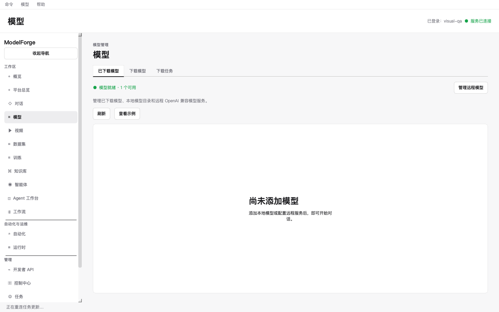
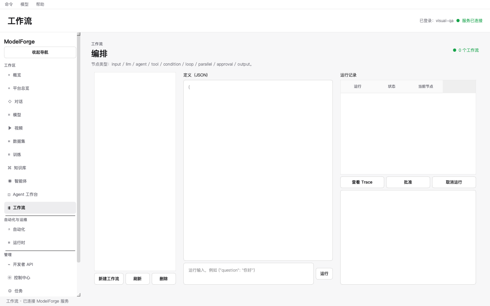
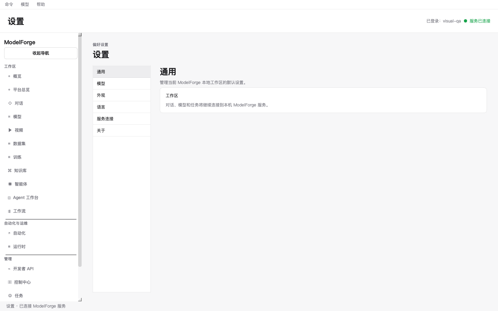
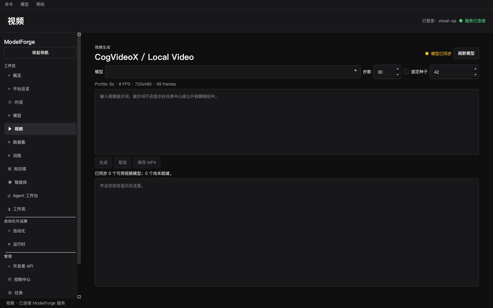

# ModelForge 全系统 GUI 重设计规范

> 日期：2026-09-14
>
> 状态：设计提案，待评审，不代表已经实现
>
> 适用：PySide6 桌面客户端，macOS 优先，兼顾 Windows / Linux
>
> 本次交付：仅设计文档及现状截图附件，不修改业务代码、主题代码、翻译资源或 API。

## 1. 设计结论

ModelForge 应从“多个功能页面拼接的管理工具”，调整为“统一、安静、专业的本地 AI 工作站”。

建议采用 **macOS 原生工具的结构感 + 中性灰白材质 + 克制的蓝色交互重点 + 精准的运行状态反馈**。科技感来自模型、任务和资源的真实可视化，不来自霓虹、装饰性渐变或大量玻璃卡片。

这次重设计不是简单换肤，必须同时完成四项工作：

1. **统一结构**：合并重复入口，每个页面使用同一套标题、工具栏、内容区和详情区规则。
2. **统一视觉**：颜色、字体、图标、间距、状态、表格、表单和弹窗共用设计系统。
3. **简化操作**：围绕“开始对话、准备模型、查看任务、创建运行”组织流程，专业参数按需展开。
4. **完整本地化**：中文、英文、日文覆盖静态及动态产品文本，而不只覆盖一级导航。

### 1.1 范围与边界

- 覆盖当前 19 个注册页面、模型子页、登录、首次配置、远程服务配置、任务详情、审批、恢复及更新等辅助界面。
- 保留现有业务能力；合并的是入口和展示，不是删除模型管理、运维、审计或权限能力。
- 延续 PySide6、现有 API Client、异步 Worker、TaskStore 和流式事件机制；不建议为了换肤迁移到 Web 或重写后端。
- 本文中的组件名、翻译键、布局尺寸和验收项是未来实现要求，不是当前能力声明。
- 视频内嵌播放、工作流可视编辑等涉及新交互能力的项目单独标注，不混入基础换肤的承诺。

### 1.2 阅读导航

| 读者 | 重点章节 |
|---|---|
| 产品与评审 | 2 现状、3 风格、4 导航、7 页面方案 |
| 设计 | 5 视觉令牌、6 组件、7 页面、8 操作流程 |
| 客户端研发 | 9 i18n、10 平台适配、11 落地边界 |
| 测试与验收 | 12 排期、13 验收、附录 A 截图 |

## 2. 现状与问题依据

### 2.1 本次调研口径

以本次工作区实际代码为依据，包括已有未提交改动。已有历史设计文档只作背景，不视为当前实现事实。

使用现有 `reports/render_pages_offscreen.py` 和 `DesktopContractStub` 生成离屏快照；默认语言采集覆盖 19 个页面的浅色、深色以及深色登录，共 39 张。脚本报告 `ALL_CAPTURES_OK`，调用的是桩接口，不是真实服务。本文人工检查并收录模型、工作流、设置、视频四个页面。

**证据限制**：实时桌面读取超时；离屏截图不是线上操作审计。未验证真实数据、网络恢复、实际运行、键盘焦点、VoiceOver、Retina 或语言热切换。空数据及同步状态来自桩数据，不用于判断真实服务健康。没有将历史截图当作本次证据。

### 2.2 已确认的结构问题

| 问题 | 当前依据 | 用户影响 | 设计处理 |
|---|---|---|---|
| 导航过长、相近入口并列 | `NavigationRail.GROUPS` 展示 18 个入口；`MainWindow._pages` 注册 19 个页面 | 首页、平台总览、智能体、Agent 工作台等概念需要额外辨认 | 合并同一任务域，保留旧入口重定向 |
| 顶栏与页面重复大标题 | `TopContext` 与页面 `MFSection`；截图 A1～A4 | 消耗首屏高度，弱化内容 | 顶栏仅上下文，内容区保留唯一主标题 |
| 页面结构不一致 | `MFSection`、独立标题、`QGroupBox`、多列列表和文本框并存 | 每进入一个模块都要重新寻找操作 | 统一四类页面模板 |
| 全局状态和页面状态分散 | shell、模型就绪提示、页内状态标签、页脚各自展示 | 难以分清服务连接、模型可用、任务进度 | 明确全局、对象、任务三层状态 |
| 工程数据直接成为主界面 | dashboard、workflow、workbench 等使用只读文本展示结构化数据 | 非专业用户必须阅读 JSON 或字段名 | 摘要、属性行、时间线优先，原始数据放详情 |
| 图标缺少统一语义 | `theme/icons.py` 当前使用 Unicode 字形 | 相似符号难辨识，跨平台外观不稳定 | 统一矢量图标资源及语义映射 |
| 设计规则存在多份口径 | `tokens.py` 与 `metrics.py` 重复定义尺寸，值有差异 | 页面按不同尺寸设计，旧文档难以指导开发 | 每个令牌只保留一个负责模块 |
| 产品说明占据操作空间 | 工作流、工作台、扩展等首屏有长段功能解释 | 界面像使用说明而不是工作区 | 删除常驻功能介绍，保留必要风险和状态信息 |

尺寸差异示例：当前 `tokens.py` 的顶栏为 52、最小窗口为 1120×720；`metrics.py` 的顶栏为 68、最小窗口为 1024×680。旧设计文档又包含 1180×720 的描述。本方案以第 5、10 节作为未来统一口径，但本次不修改任何现有定义。

### 2.3 i18n 为什么显得只完成了一级

当前并非没有页面翻译，而是存在两条并行路径：

- `i18n/*.json` 主要承载导航、设置和通用操作键。
- `ui_localizer.py` 的 `_TEXT` 承载大量完整字符串映射，`localize_tree()` 遍历部分旧控件。

静态检查发现的覆盖缺口与风险：

| 范围 | 当前证据 | 判断 |
|---|---|---|
| 模型二级标签 | 模型页使用 `QTabBar`，旧遍历仅处理 `QTabWidget` | 不能指望现有通用遍历翻译该标签 |
| 表格、列表 | 遍历没有表头、`QTableWidgetItem`、`QListWidgetItem` 的通用处理 | 必须逐页确认，不能由一级标题已翻译推断覆盖完成 |
| 复选框、Tooltip | 遍历文本分支主要处理 `QLabel` / `QPushButton`，没有完整 Tooltip 更新路径 | 各类控件存在覆盖不一致风险 |
| 动态状态 | settings、video、automation 等仍有直接拼接中文字符串 | 数据刷新后可能重新出现源语言 |
| 可访问名称 | 默认名称中存在中文回退，已有 accessibleName 会被跳过 | 切换语言后读屏标签可能停留在旧语言 |
| 页面术语 | 视频主标题为 `CogVideoX / Local Video`，设置含 `Endpoint` / `Account` | 产品标签与技术标识没有明确区分 |
| 热切换状态 | `_source()` 缓存初始控件文本，动态状态又可自行更新 | 需要验证旧文本回写、选择变化和异步回调问题 |
| 测试粒度 | `tests/test_i18n_runtime.py` 检查少量词条映射 | 该测试不能证明全页面、动态状态和布局覆盖 |

以上是代码依据，不等同于已完成三语言运行验证。本文不虚构“当前翻译覆盖率”。

## 3. 风格方向：克制的 Mac AI 工作站

### 3.1 视觉关键词

**清晰、轻盈、精密、安静、可信。**

借鉴 macOS 的工具栏、侧边栏、检查器、系统字体、焦点和交互习惯，而不是机械模仿系统窗口。浅色以冷中性灰和白为基底，深色以石墨灰为基底；蓝色只标识可操作焦点，绿、琥珀、红只标识真实状态。

| 采用 | 不采用 |
|---|---|
| 细分割线、清晰对齐、有限层次 | 每个区块一个大圆角卡片 |
| 原生窗口行为、系统字体 | 手绘 macOS 红黄绿按钮、品牌字距拉伸 |
| 一致的线性图标和紧凑工具栏 | Unicode 几何符号当主导航图标 |
| 真实进度、资源、运行阶段 | 伪造 GPU 数字、无数据也跳动的曲线 |
| 窄范围半透明系统材质 | 全屏玻璃、模糊内容、大面积发光 |
| 主操作明确，次要操作收纳 | 一排同等级的刷新、删除、运行、示例按钮 |
| 完整的浅色和深色设计 | 仅反转颜色、整页蓝紫色或单色渐变 |

### 3.2 信息显示原则

- 首屏回答“我在哪里、当前是什么状态、下一步能做什么”。
- 默认显示完成任务所需的最少参数；专业配置在同页高级区域保留。
- 每个独立操作上下文最多一个高强调主操作；弹窗打开时主操作归弹窗。
- 不常驻展示介绍功能、说明布局或教授快捷键的段落。帮助内容进入帮助菜单或 Tooltip。
- 权限、外部请求、消耗资源、删除范围、密钥只显示一次等风险信息不能为了简洁而隐藏。
- 列表、编辑器、时间线、结果预览才是主内容，标题与装饰不应抢占空间。

## 4. 全系统信息架构

### 4.1 建议主导航

| 分组 | 常驻入口 | 子视图 |
|---|---|---|
| 工作区 | 首页、对话、视频 | 首页含最近工作 / 系统概况；对话含会话列表 |
| 资源 | 模型、数据集、知识库 | 模型含本地 / 远程服务 / 发现 / 下载；知识库含文档 / 集合 / 检索 |
| 构建 | 智能体、工作流、训练 | 智能体含定义 / 模板 / 运行；工作流含定义 / 运行 / 计划 |
| 运行 | 任务、运行时 | 任务含全部 / 需处理 / 活动 |
| 高级（默认收起） | 开发者、控制中心、扩展 | 按权限开放；高级只是导航分组，不是权限机制 |
| 底部固定 | 设置、账户菜单 | 设置与退出登录不能被导航滚动隐藏 |

默认 11 个业务入口，高级项折叠；组内保留文字，不强制用户记忆图标。允许固定高频入口，但首版不依赖个性化才能可用。

### 4.2 19 个现有页面的完整去向

| 当前路由 | 当前页面 | 新位置 | 保留要求 |
|---|---|---|---|
| `overview` | WorkspacePage | 首页 / 最近工作 | 模型就绪、继续工作、待处理任务 |
| `dashboard` | DashboardPage | 首页 / 系统概况 | 平台摘要、资源、加载模型、异常 |
| `chat` | ChatPage + SessionSidebar | 对话 | 会话、模型选择、知识库开关、流式响应 |
| `videos` | VideoPage | 视频 | 参数、生成、取消、状态、保存 MP4 |
| `models` | ModelsPage | 模型 | 本地模型、远程服务、发现与下载 |
| `datasets` | DatasetPage | 数据集 | 上传、预览、校验、训练预检、删除 |
| `training` | TrainingPage | 训练 | 配置、模板、提交、停止、注册产物 |
| `knowledge` | KnowledgePage | 知识库 | 文档、分块、检索、回答与来源 |
| `agents` | AgentPage | 智能体 / 定义、运行 | 创建、运行、取消、审批、结果 |
| `workbench` | AgentWorkbenchPage | 智能体 / 模板、版本 | 定义快照、工具权限、知识范围 |
| `workflows` | WorkflowPage | 工作流 / 定义、运行 | 原始定义、输入、运行与 Trace |
| `automation` | AutomationPage | 工作流 / 计划 | 草稿、启用、暂停、下五次、历史 |
| `tasks` | TaskCenterPage | 任务 | 快照、事件流、重试、取消、日志、导出 |
| `activity` | ActivityPage | 任务 / 活动 | 保留按时间查看活动的能力 |
| `runtime` | RuntimePage | 运行时 | 模型加载、释放及真实资源状态 |
| `developer` | DeveloperApiPage | 高级 / 开发者 | 组织、项目、授权、密钥、额度、用量 |
| `control` | ControlCenterPage | 高级 / 控制中心 | 记忆、产物、集合、配置档、洞察、数据库、审计 |
| `extensions` | ExtensionsPage | 高级 / 扩展 | 已加载扩展、健康、影响、生命周期 |
| `settings` | SettingsPage | 固定入口 / 设置 | 通用、模型存储、外观、语言、连接、关于 |

知识集合可以在知识库提供直达入口，插件/MCP 配置档可以在扩展提供直达入口，但首阶段仍由现有控制中心功能负责；不能复制出两套编辑状态或混淆“配置档”和“已加载扩展”。

旧菜单、快捷入口、恢复记录保留路由别名，定位到新位置。任务详情返回原页时保留筛选、选择与滚动位置。命令面板搜索支持旧名称，不因改名使老用户失去入口。

### 4.3 顶栏、页面与页脚各管什么

| 区域 | 内容 | 禁止 |
|---|---|---|
| 系统标题栏 | 原生窗口控制及平台菜单 | 自绘假系统按钮 |
| 应用工具栏 | 导航折叠、位置/对象上下文、命令搜索、连接状态 | 再显示一次大号页面标题、长日志 |
| 页面标题区 | 唯一标题、必要对象状态、一个主操作 | 重复的 eyebrow、长段说明 |
| 页面工具栏 | 搜索、筛选、视图切换、刷新、更多 | 全局账户或连接配置 |
| 内容区 | 列表、编辑、结果、运行过程 | 以空白大卡片代替实际内容 |
| 右侧检查器 | 当前对象属性、日志、高级配置 | 默认在所有页面常驻 |
| 底部状态栏 | 当前后台任务摘要；异常时显示连接问题 | 把内部 URL、错误码、长路径直接铺满 |

健康连接在顶栏低强调展示；状态栏正常时优先显示后台工作，异常时显示恢复状态。一个事件不同时触发弹窗、横幅和通知三种反馈。

## 5. 统一视觉令牌

本节数值为设计起点，使用 Qt 逻辑像素，不是物理像素。实现时所有页面从共享令牌读取，禁止逐页复制色值和尺寸。

### 5.1 颜色

| 语义令牌 | 浅色 | 深色 | 用途 |
|---|---|---|---|
| `background.app` | `#F5F6F8` | `#17181A` | 应用基底 |
| `background.sidebar` | `#ECEEF1` | `#202124` | 导航层次 |
| `background.content` | `#FFFFFF` | `#242528` | 内容、表格、输入表面 |
| `background.subtle` | `#F2F3F5` | `#2B2D31` | 弱分区、表头 |
| `background.hover` | `#E9EDF2` | `#33363C` | 悬停 |
| `border.subtle` | `#DDE1E7` | `#3D4149` | 装饰分割线 |
| `border.control` | `#7B8491` | `#8B949F` | 需独立辨认的输入边界 |
| `text.primary` | `#20242B` | `#F4F5F7` | 正文、标题 |
| `text.secondary` | `#596270` | `#B3BAC5` | 次要但需阅读的信息 |
| `text.disabled` | `#929AA6` | `#767E89` | 禁用，不承载必要解释 |
| `accent.primary` | `#0066CC` | `#0A66CE` | 主按钮，白色文字 |
| `accent.foreground` | `#0066CC` | `#7CB7FF` | 文本链接、选中图标 |
| `selection.background` | `#E5F0FF` | `#253A54` | 选中行或导航 |
| `focus.ring` | `#0066CC` | `#87BCFF` | 键盘焦点 |
| `status.success` | `#177245` | `#72D7A0` | 成功、已就绪 |
| `status.warning` | `#946200` | `#EDC269` | 需处理、受限 |
| `status.danger` | `#B42332` | `#FF98A0` | 错误、危险 |
| `status.info` | `#0066CC` | `#7CB7FF` | 进行中、信息 |

强调色不填满大片背景；状态色不作为装饰。弱分割线不承担识别控件的唯一职责。以上颜色仍需按实际相邻背景、字号、状态逐对验证对比度，不能因定义了令牌就声称达到无障碍标准。

### 5.2 字体与排版

| 用途 | 字号 / 行高 | 字重 |
|---|---|---|
| 页面主标题 | 22 / 30 | 600 |
| 分区标题 | 15 / 22 | 600 |
| 正文、表单、列表 | 13 / 20 | 400 |
| 按钮、导航 | 13 / 18 | 500 |
| 辅助元数据 | 12 / 18 | 400 |
| 对话正文 | 14 / 22 | 400 |
| 代码、日志 | 12 / 18 | 400，等宽 |
| 关键指标 | 24 / 30 | 600，等宽数字 |

- UI 优先使用 Qt 系统字体；中文与日文使用系统可用的对应字族回退，不能把 CSS 字体栈当成一个 QFont 字族。
- macOS 不打包未获授权的 SF 字体；Windows、Linux 采用当地系统字体，并单独验证截断情况。
- 所有文本字距为 0；不强制英文全大写，不随窗口宽度缩放字号。
- 页面不出现营销式超大标题；空态标题为 15/22，不沿用页面主标题样式。
- 数字右对齐或使用等宽数字；模型 ID、路径、Trace ID 才使用等宽字体。

### 5.3 尺寸与间距

| 项目 | 标准 |
|---|---|
| 间距序列 | 4、8、12、16、24、32 |
| 全局侧栏 | 默认 216；可调 200～260；折叠 60 |
| 应用工具栏 / 状态栏 | 52 / 28，不含操作系统窗口边框 |
| 页面内边距 | 标准 24，窄窗口 16 |
| 标题与工具栏间距 | 16 |
| 分区间距 / 表单行间距 | 24 / 16 |
| 按钮、输入框 | 最小高 32；舒适模式 36 |
| 图标按钮 | 稳定 32×32，图标 16；触控适配最小 44×44 |
| 普通导航行 | 32，行间 2；不能因选中变高 |
| 表格行 | 标准 36；紧凑 30；内容换行时允许按行增长 |
| 常见内容列表 | 单行 36；带元数据的两行项 52 |
| 详情检查器 | 默认 320，可调 280～400；不足时切换为独立详情视图 |
| 圆角 | 控件 6，重复条目卡片 8，应用内弹窗 8；原生窗口遵循系统 |
| 分割线 / 焦点环 | 1 / 2 |

页面分区不使用浮动卡片。表格外不再套卡片，卡片内部不再嵌卡片。阴影仅用于菜单、弹窗等真实浮层，普通列表和分区使用留白、底色或细线区分。

### 5.4 图标与动效

采用一套 Lucide 线性图标资源，经项目现有图标封装统一输出为 `QIcon`，不直接引入仅面向 Web 的组件包。统一视觉网格、线宽和光学尺寸，不混用 emoji、字符图标与另一套风格。图标资源应保留许可证。

建议语义：首页 `House`、对话 `MessageSquare`、模型 `Box`、数据集 `Database`、知识库 `BookOpen`、智能体 `Bot`、工作流 `Workflow`、训练 `SlidersHorizontal`、任务 `ListTodo`、运行时 `Activity`、设置 `Settings`。

刷新、复制、保存、导出、折叠、关闭使用图标按钮；所有图标按钮都有当前语言 Tooltip 和可访问名称。新建项目、开始训练、生成视频等明确命令可使用图标加文字。危险确认必须有文字，不用单独垃圾桶图标代表最终确认。

悬停/选中反馈 100～140ms；检查器展开 160～200ms。不得用弹跳、循环闪烁或页面滑动制造科技感。开启减少动态效果时关闭非必要过渡，真实任务进度仍可静态更新。

## 6. 统一页面模板与组件

### 6.1 四种页面模板

| 模板 | 结构 | 使用页面 |
|---|---|---|
| 资源列表 | 标题 + 搜索筛选 + 表格/列表 + 按需检查器 | 模型、数据集、任务、扩展 |
| 工作编辑器 | 对象列表 + 主编辑/结果区 + 按需参数 | 对话、视频、智能体、工作流 |
| 配置表单 | 单标题 + 分组设置行 + 固定动作区 | 设置、连接配置、训练创建 |
| 运行详情 | 摘要 + 进度/时间线 + 产物 + 日志标签 | 训练、任务、Agent Run、工作流 Run |

已有 `MFSection`、`MFStatusBadge`、`MFEmptyState` 等应演进为统一组件，不平行建立第二套页面框架。新增加的组件只解决真实复用需求。

### 6.2 核心组件契约

| 组件概念 | 统一规则 |
|---|---|
| PageHeader | 唯一标题；对象状态紧邻标题；右侧至多一个主操作 |
| PageToolbar | 搜索靠左，筛选居中，视图/刷新/更多靠右；空间不足时换行 |
| DataTable | 表头、排序、选择、空态、加载、错误、分页/增量加载统一 |
| SettingsRow | 标签与控件对应；必要影响说明贴近字段；不把每行做成卡片 |
| ModelPicker | 本地/远程分组，能力与就绪状态可见；值绑定稳定模型 ID |
| StatusBadge | 图标 + 本地化短文本；运行、成功、等待、失败不共用同一个绿色状态 |
| Inspector | 当前对象标题、属性、动作；关闭后恢复主区焦点 |
| EmptyState | 简短状态、一个直接操作；不将“请求失败”伪装为“没有数据” |
| InlineError | 字段或对象附近显示问题与恢复操作；保留已输入内容 |
| ConfirmDialog | 动作、对象、影响、取消与明确确认；默认焦点非危险动作 |
| ExecutionPreview | 执行对象、权限、资源/外部访问、阻断原因；预览本身不执行 |

### 6.3 表格和列表

- 默认展示 5～7 个关键列，ID、完整路径、堆栈进入检查器；下载等专业列表允许额外列，但提供隐藏和横向滚动。
- 名称列优先获得空间，数值列右对齐；长路径可中间省略并可复制，错误正文和确认文案不得省略。
- 行选中和键盘焦点必须分别可辨认。删除、停止、重试只针对明确选中的对象。
- 排序保留对象 ID、选择和滚动锚点；事件更新不能让用户刚要点击的任务跳到另一行。
- 右键菜单与工具栏提供相同动作语义；重要操作不能只存在于右键菜单。
- 首次加载使用稳定的占位行；刷新保留现有内容和“更新中”状态，不反复清空整个表格。
- 批量操作只出现在已有后端支持的页面；部分成功时逐项说明结果，不能统一报“成功”。

### 6.4 表单和确认

- 模式选择用分段控件；多选项用下拉菜单；二元设置用开关/复选框；数字用输入框或步进器。
- 精确参数不只提供滑块；复杂 JSON 不直接取代有固定结构的常用表单。
- 标签常驻，Placeholder 只给格式示例；校验错误放在字段下，不重复弹出多个消息框。
- 本地偏好如语言、外观立即生效；连接、存储、密钥、预算等有影响的配置显式保存，并显示成功/失败。
- 提交期间锁定本次提交，保留输入，不乐观宣称任务已启动；后台确认后展示任务链接。
- 低风险保存用原位反馈；销毁、外部执行、收费/高资源操作及权限变更保留必要确认。

### 6.5 全系统状态字典

以下为 UI 语义，具体映射以现有服务枚举为准，不新增后端状态。

| 语义 | 呈现 | 可用操作 |
|---|---|---|
| 首次加载 | 稳定占位 + 正在加载 | 必要时取消等待 |
| 无数据 | 简短空态 + 新建/添加 | 创建入口 |
| 无搜索结果 | 保留筛选 + 无匹配结果 | 清除筛选 |
| 排队 / 运行中 | 阶段、真实进度；未知总量不用假百分比 | 服务支持时取消 |
| 等待审批 | 琥珀状态 + 审批对象 | 审阅、批准或拒绝 |
| 已完成 | 结果摘要 + 产物 | 打开、保存、关联任务 |
| 失败 | 本地化原因 + 恢复入口 | 仅允许的重试或修复 |
| 已请求停止 | 等待后台确认 | 不再重复提交停止 |
| 已取消 | 中性终态 | 查看详情；不能当作失败计数 |
| 服务离线 | 顶部统一横幅，旧数据标记过期 | 检查连接、显式重试 |
| 实时流重连 | 保留快照，标记实时更新中断 | 不重复创建任务 |
| 权限不足 | 可阅读范围与限制明确 | 不暴露越权操作 |
| 部分可用 | 可用项继续操作，不可用项说明原因 | 局部恢复 |
| 未提供数据 | “暂无数据”或“不可用” | 不是 0，也不是成功 |

## 7. 全页面重设计

### 7.1 首页：继续工作，不做宣传页

默认展示最近会话/运行、正在进行的任务以及需要处理的事项。系统概况放到同页标签，不与首页重复成为一级入口。

- 有历史内容：最近工作列表占主区，待审批/失败任务作为紧凑侧区；最多展示四项关键系统指标。
- 首次使用：以“配置模型”为主操作，提供本地模型与远程服务两个路径；可跳过并浏览其他页面。
- 模型就绪提示必须区分“存在配置”“已验证”“实际可用”，不能仅根据连接成功显示已就绪。
- 点击最近项直接回到会话或运行详情，保留原任务身份；不存在的记录显示失效，不跳到无关页面。
- 不显示随机示例数据、无来源曲线或大幅欢迎标语。

### 7.2 对话：把模型配置从输入区移走

布局为会话列表 + 对话正文 + 底部输入区。参数检查器默认关闭。

- 会话侧栏默认 220；新建、搜索在顶部，重命名、删除在条目菜单。
- 顶部只保留一个统一 ModelPicker，展示模型名、本地/远程、状态；不并列“本地模型下拉 + 模型名称输入 + 服务下拉”。
- 正文最大可读宽度 840，在宽窗口中居中；流式输出不抖动，不自动把用户正在阅读的位置拉到底部。
- 输入区使用多行文本框，高度 88～200；发送/停止用稳定尺寸图标按钮，知识库使用有明确状态的开关或选择控件。
- IME 组合输入期间 Enter 不触发发送；默认 Enter 发送、Shift+Enter 换行，可在偏好中调整。
- 失败保留草稿和已收到内容，不自动重发；重试明确针对哪条消息。
- 常用参数放检查器，实际不支持的能力不展示可操作控件。
- 富文本升级需独立安全验证：不执行输出中的 HTML/脚本，不自动加载外部图片，不自动打开链接；纯文本安全显示必须保留。

### 7.3 模型：一个资源中心，四个清晰子视图

保留当前本地模型与下载能力，调整为“本地、远程服务、发现、下载”。远程服务不再藏在“已下载模型”的管理按钮后。

| 子视图 | 主内容 | 主操作 / 状态 |
|---|---|---|
| 本地 | 名称、能力、格式/量化、大小、就绪状态 | 添加模型；选中后使用或查看详情 |
| 远程服务 | 服务名、默认模型、凭据状态、验证状态 | 添加服务；按对象验证、编辑、移除 |
| 发现 | 搜索、任务类型、格式、来源筛选；结果列表 | 选中后查看文件与兼容性，再下载 |
| 下载 | 模型/文件、阶段、进度、速度、剩余、错误 | 仅展示后端支持的取消/重试/恢复 |

- 默认列表便于比较；仅在模型重复条目确有摘要需求时提供卡片视图，卡片圆角不超过 8。
- 本地兼容性提示区分格式不支持、缺少文件、资源不足、未加载，不笼统显示“不可用”。
- 下载确认集中展示来源、目标目录、文件、许可信息和已知大小；未知大小明确标记，不估造磁盘需求。
- 远程配置使用单一表单：预设/协议、名称、地址、密钥、模型。凭据遮罩，不进入日志或通知。
- “保存”“获取模型列表/验证连接”“设为默认模型”是不同动作；网络访问由明确用户动作触发。
- 未验证但允许使用的服务显示风险状态，不为了设计一致性改变现有访问规则。
- 下载详情与全局任务通过同一任务 ID 关联；导航跳转不创建另一份任务。
- 旧 ModelCenterDialog、DownloadDialog 最终作为统一页面的入口或复用同一内容，不继续维护不同风格。

### 7.4 视频：结果优先，日志退后

使用参数/提示词区 + 结果区。宽窗口可并列，窄窗口上下排列；视频区域采用实际媒体比例并完整容纳画面，不裁切生成结果。

- 主标题统一为“视频”；CogVideoX 等是模型标识，不充当固定产品页名称。
- 常用项保留模型与提示词；步数、固定种子放高级参数，种子输入仅在开启固定种子后启用。
- 时长、帧率、尺寸是否可编辑由服务能力决定；当前固定档位显示只读摘要，不设计虚假自由选项。
- 提交后显示真实阶段、用时、取消状态；完成后突出“打开结果”和保存 MP4。
- 内嵌播放器与真实首帧缩略图属于后续客户端增强，需验证 QtMultimedia、编码器和平台支持；未实现前保留保存/系统播放器路径，不放假预览。
- 日志在详情标签；提示词的隐私保护延续现有策略，不泄露到公共任务摘要。

### 7.5 数据集：上传、预览、校验形成连续操作

主区为数据集表格；选中后检查器展示格式、行数、大小、校验摘要。

- 主操作“上传数据集”；选择文件后在同一表单完成必要字段，不连续弹出多个输入框。
- 预览用可扫描的数据表格；结构错误指向具体字段或记录，区分文件读取失败与内容校验失败。
- “训练预检”展示阻断项与警告，不默认启动训练；“用于训练”只携带选择进入训练配置。
- 删除确认说明对象及已知影响范围；保留服务实际的删除与引用约束，不假定支持撤销。

### 7.6 训练：历史列表与创建配置分离

进入页面先看任务列表和最近进度，主操作“新建训练”。配置不再与所有历史、日志一起常驻占满首屏。

- 创建使用同一面板内三个步骤：选择模型/数据集、方法/常用参数、检查与提交。
- LoRA / 全量训练显示友好标签，但提交值仍为现有枚举。
- 默认只展示模型、数据集、方法、轮次；批量大小、学习率等进入可展开参数，配置模板可复用。
- 提交前明确读取的数据集与运行影响；不将预检视为授权执行。
- 运行详情展示进度、真实 loss/epoch 数据和日志；没有曲线数据时只展示实际数值。
- 停止保留“停止请求已发送”到后台终态的过渡；训练成功后的主要动作变为“注册模型”。

### 7.7 知识库：内容与检索结果分层

文档列表、集合入口、检索为同级标签；新增文档是文档视图主操作。

- 文档显示类型、索引状态、分块数、时间；具体分块在详情中查看。
- 检索结果先展示来源、片段、可用时的得分；回答与来源建立可点击关联。
- 检索与生成分别呈现进度、失败和结果，不能因生成失败把有效检索结果清空。
- 集合管理与控制中心复用同一能力；集合不等于文件夹，不承诺自动移动文件。
- “使用知识库”范围明确；不可用文档不以已索引状态呈现。

### 7.8 智能体：定义、模板、运行放在同一上下文

将 AgentPage 与 AgentWorkbenchPage 的入口合并，保留原功能边界。

- 定义视图：左侧智能体列表，主区编辑名称、模型、系统提示，工具和知识范围按组展开。
- 模板与版本：使用列表 + 属性摘要；历史版本只读，恢复如需创建新版本应明确提示。
- 运行视图：输入与执行预览在前，时间线和结果在后；原始事件和 JSON 在技术详情。
- 查看页面、选择模板、保存定义、查看版本不会创建 Run。
- 运行、重试、批准、拒绝、取消使用一致状态和确认；审批对象、工具、作用范围不可折叠到看不到。
- 页面用“智能体”“运行记录”，技术标识中保留 Agent / Run ID，不混用作普通按钮标题。

### 7.9 工作流与计划：简单入口，保留高级能力

工作流提供定义、运行、计划标签。计划当前执行对象仍按后端的 Agent 调度能力展示，放在工作流模块不意味着支持任意工作流定时执行。

- 定义：以节点列表、节点属性、依赖摘要组织浏览；原始 JSON 保留在“高级定义”中。
- 首阶段支持从现有定义生成只读结构摘要；可视化编辑、连线和双向转换属于后续增强，需保证条件、循环、并行等语义不丢失。
- 对不能无损表达的节点，明确进入高级编辑，不静默丢字段或重写定义。
- 运行：输入与启动操作在同一区域；时间线展示当前节点和结果，Trace 在详情。
- 计划：表格展示名称、目标、频率、时区、状态、下次执行；创建草稿使用单一表单。
- 启用前展示未来五次触发时间；暂停、立即运行是独立动作。查看历史或预览不会启用计划。
- 不补跑策略、并发策略、失败阈值按实际能力显示；不把“启用”开关误解为“立即执行”。

### 7.10 任务：所有后台工作的统一观察入口

列表 + 可收起的任务详情；常用状态通过标签切换，类型和时间用筛选菜单。

- 行内显示任务名、类型、状态、进度、更新时间；日志与错误详情不占用每行。
- 详情包含概览、事件、日志、产物；可跳回来源模块。
- 取消、重试、批量重试仅在服务允许的状态开放；清楚显示批量选择数量。
- 活动视图承接原 ActivityPage，保持时间顺序与对象链接。
- 事件流断开保留最近快照，并标记数据时效；服务连接健康不等于任务流健康。
- 下载、训练等页面可有轻量任务摘要，但共享 TaskStore，不能建立互相矛盾的进度。
- 导出按当前已有格式提供，技术标识保持原值并脱敏；不因界面语言改变机器可读字段。

### 7.11 运行时：资源可读，启停明确

顶部展示服务状态、加载实例和可获得的内存/计算信息；主区为运行实例表格。

- 空闲、加载中、可用、释放中、失败语义一致；按模型显示能力与资源信息。
- 加载、释放需明确对象与已知影响，不能将释放包装成无影响的普通开关。
- 资源未知显示不可用；Apple Silicon 的统一内存不能错误标为独立显存。
- 诊断信息按需展开，当前用户无权限操作时显示原因而不是仅让按钮变灰。

### 7.12 开发者：清楚区分环境与权限

组织选择位于模块顶部，项目列表位于左侧，右侧为授权智能体、密钥、额度、用量标签。

- 项目 `test` / `live` 环境使用固定标签和文字，不只靠颜色。
- 创建组织/项目、签发密钥、修改额度分别使用明确表单；访问页面不触发签发或消费。
- 密钥只在签发成功后的专用弹窗显示一次；复制操作明确，不在列表、截图日志或通知中重复暴露。
- 用量来自账本；无数据不显示为“免费”或“零成本”。
- 示例代码保留协议字段和技术标识，周围标题、解释、错误和复制反馈完整翻译。

### 7.13 控制中心：专业功能有入口，但不挤入日常流程

保留记忆、产物、知识集合、插件/MCP 配置档、模型洞察、数据库、审计七类能力。使用模块内分类列表，不在窄窗口横排七个拥挤标签。

- 各分类复用资源列表和检查器，不为每类再设计独立按钮排布。
- 产物显示真实类型、来源和可用预览；缺失文件与无权限分开处理。
- 模型洞察明确预算、范围及数据来源；预算变更显式保存。
- 数据库诊断优先可读摘要和阻断项；只读迁移预检不能以“修复”按钮暗示实际写入。
- 审计保留时间、动作、对象、结果与脱敏关联标识；原始诊断可复制到支持渠道。

### 7.14 扩展：治理工具，不伪装为商店

默认仅展示已加载扩展，与现有能力一致；不新增看似可用的插件市场或一键安装。

- 列表展示名称、版本、状态；详情呈现工具、依赖和健康结果。
- 启动、停止、挂载、卸载挂载、卸载扩展遵循后端状态和管理员权限。
- 风险动作先展示影响预览及依赖阻断；需要确认时确认与预览绑定同一对象。
- 健康检查只读语义明确，不自动加载、启动或挂载扩展。

### 7.15 设置：接近 macOS 的分组设置行

模块分类列表 + 单列设置区，表单最大宽度 760；删除空白占位卡片及“通用”的重复介绍。

- 分类保留通用、模型、外观、语言、服务连接、关于，避免为了凑分类产生无内容页。
- 外观用系统/浅色/深色分段控件；语言显示自称：简体中文、English、日本語。
- 下载源使用下拉，目录使用路径输入与文件夹图标；关键说明仅保留“更改位置不会移动现有文件”等真实影响。
- 语言与主题即时切换，不重建会话、清空输入或重新发出业务请求。
- 连接页提供可读状态，服务地址与账户按属性行展示；不把完整 Endpoint 文本塞进全局栏。
- 更新页保留签名/校验、下载、失败与重试状态，只有明确点击才进行安装或打开安装包。

### 7.16 登录、引导及所有辅助窗口

| 界面 | 设计要求 |
|---|---|
| 登录 / 注册 | 紧凑单列，品牌可见，模式用标签切换；服务地址与状态明确，错误贴近字段 |
| 首次模型配置 | 本地 / 远程两条路径；允许稍后处理，已完成步骤可恢复；不自动下载或运行 |
| 远程服务表单 | 与模型页共用控件和校验，密钥遮罩，网络动作明确 |
| 模型/文件选择 | 搜索、兼容性、选中摘要、确认动作；对象 ID 与显示名分离 |
| 示例库 | 只在相关上下文或帮助入口打开；采用模板不等于执行 |
| 运行轨迹 | 摘要、阶段、事件、技术详情；原始内容只读且脱敏 |
| 执行/审批预览 | 对象、权限、外部访问、阻断原因完整可见；取消后无副作用 |
| 恢复窗口 | 展示可恢复内容及时间；恢复界面状态与重新运行任务分开确认 |
| 更新窗口 | 版本、校验状态、下载进度、重试；失败不显示为已安装 |
| 删除/停止确认 | 动作命名、对象名、影响范围，使用 QDialogButtonBox 的平台按钮顺序 |
| 文件选择器 | 优先系统原生；应用自定义标题翻译，系统按钮语言由操作系统控制 |

## 8. 关键操作路径与“简单”的定义

以下是未来目标，不是已测量结果。计数指页面/步骤切换，不包含输入内容、网络等待及必要安全确认。

| 目标 | 目标路径 | 验收重点 |
|---|---|---|
| 已配置模型后开始对话 | 对话 → 输入并发送 | 不再要求去运行时理解加载流程；必要准备状态可见 |
| 首次使用远程模型 | 配置模型 → 远程表单 → 显式获取/验证 → 选择并保存 → 对话 | 一次表单内完成配置，不手填散落的多个模型字段 |
| 下载本地模型 | 模型/发现 → 搜索与详情 → 确认文件和目录 → 下载 | 任务入口始终可找到，完成后能定位本地模型 |
| 从数据集开始训练 | 数据集选择 → 训练预检/配置 → 确认提交 | 自动携带数据集 ID，预检不执行 |
| 创建智能体并运行 | 定义 → 执行输入/预览 → 显式运行 | 保存定义与运行严格分离 |
| 查看失败原因 | 任务 → 失败项 → 详情/恢复 | 不强迫先打开原始日志找错误 |
| 改语言 | 设置 → 语言 → 选择 | 当前页、已打开弹窗及后续动态内容全部更新 |

统一的错误表达为“发生了什么 + 当前结果 + 可执行恢复动作”。例如“模型加载失败”与“重试/查看详情”；技术错误码、关联 ID 在详情提供，不原样铺满主页面。不得承诺后端不支持的恢复或自动重试。

## 9. i18n 全覆盖规范

### 9.1 支持范围

本轮保持现有 `zh_CN`、`en_US`、`ja_JP`；不擅自扩展其他语言。中文仍是默认语言，用户显式选择持久化。未来“跟随系统语言”需作为独立选项设计，不能悄悄覆盖用户选择。

| 必须翻译 | 保持原值 |
|---|---|
| 导航、标题、二级标签、菜单、命令面板 | ModelForge、服务商与模型专有名称 |
| 按钮、表头、列表状态、筛选项 | 模型 ID、任务 ID、文件路径、URL、扩展标识 |
| 标签、Placeholder、Tooltip、校验 | 用户输入、会话正文、提示词、文档内容 |
| 空态、加载、成功、错误、确认、恢复、更新 | API 字段、协议枚举值、示例代码机器字段 |
| 动态计数、时间摘要、下载进度、运行阶段 | 原始日志与服务返回的原始诊断内容 |
| accessibleName、accessibleDescription | JSON 导出字段与原始状态值 |

原始诊断保留原文，但其外层标题、说明、状态摘要与恢复操作必须翻译。不自动翻译用户内容，不因界面语言变化改写项目名或生成历史。

### 9.2 单一翻译资源与稳定键

目标为显式语义键 + 三份语言资源 + 统一格式化入口；复用现有 I18n 组织方式，逐步退出以中文整句匹配为主的旧方案。

建议键域：`nav.*`、`common.*`、`models.*`、`chat.*`、`videos.*`、`datasets.*`、`training.*`、`knowledge.*`、`agents.*`、`workflows.*`、`automation.*`、`tasks.*`、`runtime.*`、`developer.*`、`control.*`、`extensions.*`、`settings.*`、`auth.*`、`onboarding.*`、`errors.*`、`a11y.*`。

示例：`models.download.confirm.title`、`models.download.progress`、`tasks.status.running`、`settings.storage.path.label`。本段为命名规范，不表示当前已存在这些键。

- 同义通用动作复用键；“取消弹窗”和“取消任务”等不同语义不强行复用同一个翻译。
- 禁止先拼接中文再翻译，也不拼接“已 + 动词”等不适合跨语言的句子。
- 动态消息保存消息键和参数；以当前语言渲染完整句子，参数名保持一致。
- 状态值、路由、模型选择、表格对象绑定稳定 ID，不从翻译后的标签反推业务行为。
- 枚举统一在展示层映射；未知枚举显示“未知状态”，原值在技术详情保留。
- 品牌与技术术语使用明确白名单，不以“包含英文就不翻译”作为扫描豁免。

### 9.3 文案示例与术语

| 中文 | English | 日本語 |
|---|---|---|
| 首页 | Home | ホーム |
| 模型 | Models | モデル |
| 远程服务 | Remote Providers | リモートサービス |
| 智能体 | Agents | エージェント |
| 运行记录 | Run History | 実行履歴 |
| 待审批 | Awaiting Approval | 承認待ち |
| 已请求停止 | Stop Requested | 停止要求済み |
| 暂无数据 | No Data | データなし |
| 模型加载失败 | Model Loading Failed | モデルの読み込みに失敗しました |
| 下载到 {path} | Download to {path} | {path} にダウンロード |
| 已下载 {downloaded}，共 {total} | {downloaded} of {total} downloaded | {total} 中 {downloaded} をダウンロード済み |

日文示例为产品用语草案，发布前需母语审校。英文按钮采用简洁动词，不机械逐字翻译中文长句。

### 9.4 数量、日期、单位与错误

- 英文数量必须区分 `1 task` / `2 tasks`；中文、日文有各自完整消息，不写 `task(s)`。
- 使用成熟的复数规则与本地化格式化能力，如 Qt numerus/QLocale 或经评估的等价方案；不另造一套零散判断。
- 三语言参数占位符集合一致；缺参、重复占位符、错误格式在测试中失败。
- 日期按显示语言格式化；计划使用任务配置的时区，详情可见时区及 UTC 偏移。界面语言变化不改变计划时刻。
- 文件大小统一采用 IEC：KiB、MiB、GiB；传输速率为 MiB/s；接口若返回其他单位先明确转换，不混称 GB/GiB。
- 进度与数值按 locale 格式化；未知总量和未知剩余时间有独立文案。
- 错误采用稳定错误码到本地化产品提示的映射；未知错误用通用提示，保留脱敏技术详情。
- 服务端返回原始自然语言无法保证与 UI 同语言，不能伪称已翻译；主摘要由客户端键生成。

### 9.5 语言热切换契约

1. 用户选择语言后，更新菜单、导航、页面、表格头、标签、筛选选项、Tooltip、可访问名称和当前弹窗。
2. 表格和列表按已有原始数据重新渲染展示文本，不重新执行查询之外的业务动作。
3. 保留用户输入、密码、选择对象、筛选语义、光标、滚动位置、展开状态及当前任务 ID。
4. 更新动态消息时重新使用当前 locale，不捕获创建 Worker 时的旧语言。
5. 流式正文、日志原文和用户命名保持原样；外围生成状态按新语言更新。
6. 隐藏页面在再次显示时更新；已经销毁的页面不保留语言监听器。
7. 更改语言不引发模型下载、任务创建、验证连接、重新发送消息或重置任务订阅。

禁止通过高频扫描整个控件树维持翻译。旧适配器仅作为迁移桥梁：每迁移一个页面，明确谁负责翻译，避免显式翻译和缓存源文本互相覆盖。

### 9.6 漏译、扩展和原生控件

- 开发/测试环境缺键显示可识别标记并记录，不悄悄算通过；发布环境可回退默认中文保证可用，但已知缺键必须阻止发布。
- 三语言键集合、非空值和参数签名必须一致；相同译文不能自动视为正确，需要术语白名单。
- 英文、日文按比中文更长的文本预留空间；使用伪本地化将文案扩长至 1.4～1.6 倍进行压力测试。
- 按钮优先按内容增宽，再调整工具栏换行或收纳次要操作；不能通过缩小字号解决拥挤。
- 确认文案、错误、权限说明完整换行；导航允许合理两行或扩宽，不能截断到无法区分。
- Qt 标准按钮加载相应翻译资源；系统原生文件选择器的 OS 文案可能跟随操作系统语言，这一边界单独验收，不承诺应用能够强制改写。

## 10. macOS、尺寸与无障碍

### 10.1 原生体验与降级

- 使用系统标题栏、原生窗口控制、macOS 菜单栏与平台化 QDialogButtonBox 顺序。
- 设置使用系统习惯的 Cmd+,；复制、查找、关闭等优先 QKeySequence 标准键。现有 Cmd/Ctrl+K 命令面板可保留，快捷键不作为常驻页面教学文案。
- 支持键盘导航、清晰焦点、菜单访问和 Escape 关闭非阻塞浮层；危险操作不设默认 Enter 确认。
- macOS 半透明侧栏是可选增强，需要原生桥接和对比度验证；QSS 不等同于系统 vibrancy。
- 透明材质不可用、用户减少透明度、Windows/Linux 环境下，使用同一令牌的实色降级，不影响层级和功能。
- Retina 下以逻辑像素布局、矢量图标绘制；字体可读，不为适配平台手工缩放整个窗口位图。

### 10.2 窗口适配

设计最低目标保持当前有效的 1024×680，不通过抬高最小尺寸回避布局问题；推荐工作尺寸 1440×900。下表宽度按应用可用逻辑宽度判断，不是屏幕物理分辨率。

| 宽度 | 布局策略 |
|---|---|
| ≥1440 | 标准侧栏；可按需展开次级列表与检查器 |
| 1200～1439 | 标准侧栏；检查器默认关闭；工具栏按内容布局 |
| 1024～1199 | 默认折叠全局侧栏；次级列表和检查器互斥；复杂详情替换主区并提供返回 |
| 低于最低目标 | 不压缩到不可读；必要滚动兜底，不作为桌面交付验收尺寸 |

任何断点都要按“剩余主内容宽度”二次判断；对话阅读区尽量不低于 560，工作编辑区尽量不低于 600。用户手动展开导航后空间不够，应收起其他附属栏，不缩小文字。

680 高度下隐藏装饰性介绍、压缩非内容间距，导航可滚动但设置/账户固定；表单主体滚动、底部动作区可达。表格可以自身横向滚动，整页不得因长英文产生水平溢出。

### 10.3 可访问性目标

- 正文对比度至少 4.5:1，大字至少 3:1；必要控件边界、状态图形和焦点至少 3:1。
- 以 WCAG 2.2 AA 的相关原则指导桌面验收，不仅凭截图宣称完整合规。
- 标签与输入建立 Qt buddy/可访问关联；图标按钮、进度、错误、状态都有可访问名称。
- 不能只靠颜色区分成功/失败/等待；禁用原因可通过相邻文本或可聚焦帮助获取。
- 检查器与弹窗有确定焦点顺序，关闭后回到触发控件；不出现焦点陷阱。
- VoiceOver 实测页面、表格表头、字段错误和任务状态；连续流式输出避免每个 token 都打断读屏。
- 文字放大至 150% 时仍可操作，200% 时允许改为单栏并滚动，不能遮挡确认和取消。

## 11. 落地边界与组件责任

以下是未来研发建议，不是本次改动列表。

| 现有负责模块 | 未来责任 | 不应承担 |
|---|---|---|
| `theme/tokens.py` | 语义颜色、字体、圆角等视觉令牌 | 重复窗口布局尺寸 |
| `theme/metrics.py` | 窗口、栏宽、间距、密度和断点 | 页面各自的“特例尺寸库” |
| `theme/theme_manager.py` | 主题切换、系统模式、刷新 | 重建业务页面或请求数据 |
| `theme/icons.py` | 图标语义到 QIcon 的统一入口 | 字符图标拼接导航文本 |
| `components/mf/` | 公共组件的视觉、状态、i18n 和无障碍契约 | 网络请求与业务策略 |
| `components/app_shell.py` | 应用框架、导航、全局状态 | 页内表单或模型管理逻辑 |
| `i18n/` | 资源、翻译、格式化及迁移桥梁 | 自动翻译用户内容 |
| `pages/` | 页面组合、用户动作、对象状态展示 | 私有配色、独立按钮风格 |
| `api_client/`、Worker、Store | 保持现有协议及异步数据边界 | 由翻译文本驱动业务判断 |

### 11.1 不可退化项

- 认证、组织/项目权限、API 兼容性、任务 ID、SSE 游标和错误码保持原有语义。
- 页面切换、主题切换和语言切换不增加业务副作用，不在 GUI 主线程请求网络。
- 新布局复用既有模型就绪与任务状态来源，不自己推导“在线=可用”。
- 不因“减少点击”绕过执行预览、审批、显式启用、依赖阻断或危险操作确认。
- 无法确认执行结果时显示未知/待确认；不自动重试可能重复执行的动作。
- 保持 Worker 取消和窗口关闭清理；不得因合并页面产生重复轮询或泄漏监听器。
- 保持日志脱敏、密钥单次展示和用户内容隔离；截图与日志不得包含真实秘密。

### 11.2 与历史文档的关系

`MODELFORGE_DESIGN_SYSTEM.md` 保留为现有体系记录，`UI_AUDIT.md` 等为历史材料。本文是一份新提案，不覆盖历史事实。

评审通过后，应逐步将本规范的已实现部分同步到唯一维护的设计系统文档，明确哪些令牌与组件已落地；不要让两份互相冲突的文档都声称自己是当前唯一规范。本次不修改旧文档。

## 12. 分阶段实施建议

以完整模块为单位迁移，不以“做完一级标题”作为完成标准。每阶段同时完成视觉、交互和三语言，不把 i18n 留到最后补丁式处理。

| 阶段 | 内容 | 交付与退出条件 |
|---|---|---|
| P0 设计确认 | 导航映射、令牌、组件、模型/对话/设置三张代表页 | 确认浅深色、中英日与窄窗口规格；仅评审，不上线 |
| P1 基础统一 | shell、指标单一来源、图标、表格/表单/状态、翻译机制 | 公共组件各状态齐全，旧路由可到达，三语言基础测试通过 |
| P2 高频流程 | 首页、对话、模型四子页、设置、登录/引导 | 本地/远程就绪流程、下载、切换语言全链路通过 |
| P3 构建与内容 | 数据集、训练、知识库、智能体、工作流/计划、视频基础布局 | 定义/预览/执行隔离，状态与产物展示一致 |
| P4 运维与治理 | 任务、活动、运行时、开发者、控制中心、扩展、辅助弹窗 | 权限、日志脱敏、危险动作与多语言验收通过 |
| P5 全量验收 | 全页语言/主题/尺寸矩阵，真实服务及无障碍验证 | 无遗漏页面、无混合风格、无已知漏译和阻断回归 |

视频内嵌播放、工作流可视编辑及可选原生透明材质单独估算，不能阻挡基本统一，也不能用占位按钮冒充已实现。排期应在代表页实现验证后估算，不根据页面数量直接承诺工期。

## 13. 验收与完成定义

### 13.1 覆盖矩阵

测试以第 4.2 节的 19 个当前路由为最低追踪清单，新位置合并后仍逐项验证原能力可达。

- 三语言：中文、英文、日文；三种外观选择：浅色、深色、跟随系统。
- 稳态截图覆盖两种实际调色板：19 × 3 × 2 = 114 个主页面组合；子标签、对话框另计。系统模式另测随系统切换，不把它虚算为第三套调色板。
- 三种窗口：1024×680、1280×800、1440×900；宽屏补查 1920×1080，Retina/非 Retina 分别检查。
- 状态覆盖：空、加载、成功、失败、离线、无权限、长文本、较多数据、处理中、不可操作原因。
- 代表性最坏布局包括模型下载表、开发者详情、工作流、审批和英文/日文设置表单。

### 13.2 必须通过的检查

| 类别 | 完成标准 |
|---|---|
| 页面覆盖 | 19 个旧路由、全部新子视图及辅助窗口均有负责人与验收记录 |
| 导航 | 所有能力可达，旧入口重定向正确，返回不丢上下文 |
| 样式 | 仅共享令牌控制视觉；例外有记录；无新增页面级私有色板 |
| 结构 | 每页唯一主标题、明确主操作，无重复大标题与卡片套卡片 |
| 布局 | 最小窗口及长语言不遮挡正文/操作，不通过缩字解决问题 |
| 翻译资源 | 三语言键集合和参数 100% 对齐，缺键/空值为 0 |
| 翻译界面 | 产品控制的可翻译表面 100% 纳入清单并审核，无已知漏译；技术/用户内容按白名单豁免 |
| 动态翻译 | 刷新、异步回调、任务事件、弹窗、错误和计数使用当前语言 |
| 热切换 | 不丢草稿/焦点/对象选择，不重发消息，不重建运行，不中断已有任务 |
| 安全 | 保持权限、执行确认、预览隔离、密钥保护、日志脱敏 |
| 可访问性 | 键盘全路径、VoiceOver、颜色对比、放大、减少动态效果有实测记录 |
| 数据真实性 | 0、未知、离线、空数据分别呈现；没有假指标与假进度 |
| 生命周期 | 关闭、取消、重复进入页面不会留下 Worker、重复订阅或挂起界面 |

“100%”是未来发布门槛，不是当前测量值。词条覆盖率和界面覆盖率必须分开：前者通过 JSON 检查，后者依靠控件清单、各状态运行检查与人工审校。

### 13.3 推荐测试分层

1. 静态检查：翻译键、占位符、非法硬编码、重复令牌、非白名单图标、页面私有样式。
2. 组件测试：默认/悬停/焦点/禁用/加载/错误/选中；字体放大及长文案。
3. 页面集成：三语言切换、动态列表更新、菜单/弹窗/可访问名称同步、状态不回退。
4. 桩数据离屏截图：可重现的全页布局，捕获 Qt slot 异常；截图成功不替代行为断言。
5. 真实服务回归：本地与远程模型、下载/取消、对话流、训练、审批、计划、权限及恢复。
6. 原生桌面验收：macOS 主平台，Windows/Linux 冒烟；菜单、IME、文件选择器、焦点、读屏和高 DPI。

本次没有执行上述未来验收套件，也没有宣称新 UI 已通过测试。

## 附录 A：本次现状截图

以下图片是当前代码的离屏桩数据截图，不是新方案效果图。尺寸均为 1440×900；只支持所述布局观察，不能证明真实接口、内容或业务状态正确。

### A1. 模型页面，浅色

观察步骤 1：打开模型页。健康度：基本分区存在，但信息层次需重排。

可见顶部与页内重复“模型”，状态、说明、管理与刷新分散多行；空态占据较大区域；导航需滚动。桩数据的“可用模型”与空本地列表不是用来证明业务状态错误的依据。

### A2. 工作流页面，浅色

观察步骤 2：打开工作流页。健康度：技术操作入口存在，默认信息负担偏重。

三列同时展开，JSON 编辑器占据主区，操作分散在各列底部，未形成列表选择、编辑、运行的清晰层次。空数据场景仍显示多组动作，需要结合状态测试确认启用条件。

### A3. 设置页面，浅色

观察步骤 3：打开设置页。健康度：分类清楚，但重复层级与空白较多。

全局标题、页面标题、分类标题重复叠加；通用页主要由介绍文字组成。建议改为有实际设置值的分组行，并降低第二级分类的视觉重量。

### A4. 视频页面，深色

观察步骤 4：打开视频页。健康度：基本生成控件存在，结果体验与术语需统一。

中文环境中存在英文技术主标题与 Profile 摘要；参数、提示词、状态文本框层级接近，当前无可用模型的桩数据画面没有真实视频结果。建议统一产品标题，固定能力显示只读摘要，结果与日志分离。

这四张截图未验证键盘焦点、读屏标签或实际对比度；相关无障碍要求来自设计目标和代码风险分析，而非截图已证明的合规结论。

## 附录 B：本次源码参考

相对仓库根目录的主要检查位置：

- `client/pyside6/main.py`：页面注册、路由、语言切换、窗口尺寸。
- `client/pyside6/components/app_shell.py`：导航、上下文栏、状态栏。
- `client/pyside6/theme/{tokens,metrics,icons,theme_manager}.py`：令牌、度量、图标与主题。
- `client/pyside6/components/mf/primitives.py`：标题、面板、状态、指标、空态。
- `client/pyside6/i18n/{manager,ui_localizer}.py` 与三份语言 JSON。
- `client/pyside6/pages/`：本次页面清单内全部模块及模型下载子页。
- `client/pyside6/components/{task_center,onboarding,provider_dialog,execution_intent_preview}.py`。
- `tests/test_i18n_runtime.py`、`reports/render_pages_offscreen.py`。

**最终判断标准：** 不是“一级标题翻译了、颜色换了”，而是用户在任意模块、任意支持语言下，都能用同一套视觉与操作规则完成工作，并明确知道当前状态及下一步可做的事。
