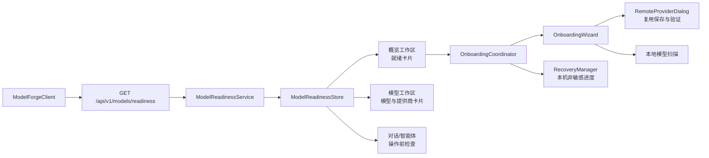
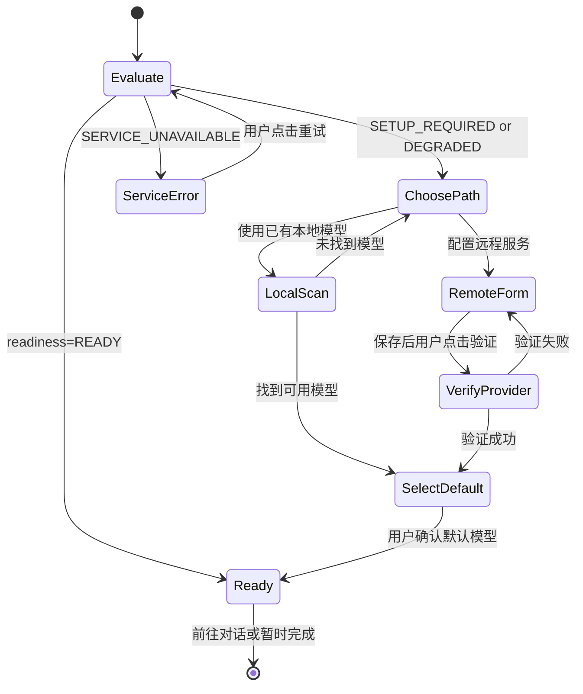

# P0 技术设计：模型就绪状态与首次使用向导

**文档状态：待确认后实施。**

**范围：** 本文仅设计 PySide6 桌面客户端的模型可用性判断与首次使用引导，不改变现有“本地优先、后端承载业务逻辑、OpenAI 兼容远程服务统一在模型页面管理”的架构原则。[1] 设计刻意不自动下载模型、不自动创建 Agent、Agent Run 或训练任务；一切会产生资源消耗或业务数据的操作必须由用户显式点击确认。

## 1. 设计目标与现状复核

当前应用已经具备模型、远程提供商、聊天、智能体和任务中心等独立能力。`ModelsPage` 会并行加载本地模型和远程提供商，远程服务可显式验证 `/models`，而概览页只显示任务连接状态并提示用户去对话页选择模型。[2] [3] 这导致首次登录且尚未配置模型的用户看到的仍是可点击的“开始对话”入口，却不能明确知道下一步应配置本地运行时还是远程服务。

现有 `/api/v1/tasks/onboarding/state` 能识别本地 `available` 模型、是否有会话及是否曾完成 Agent Run，但不会计算远程提供商是否设置密钥、是否已验证、当前用户应使用哪个默认模型，也不会区分“后端不可达”和“业务尚未配置”。[4] 因此 P0 必须新增一个**统一、无副作用、不可泄露密钥**的模型就绪快照，并由各工作区消费同一个客户端状态对象。

| 目标 | P0 交付定义 | 非目标 |
|---|---|---|
| 统一判断 | 聊天、智能体、概览和模型页对“可用模型”的结论一致 | 将所有模型运行时自动加载到内存 |
| 首次配置 | 用户可选择已有本地模型或 OpenAI 兼容远程服务，并完成明确验证 | 自动下载 Hugging Face 模型或代替用户填写密钥 |
| 可恢复失败 | 对后端离线、会话失效、无密钥、验证失败、无可选模型提供可理解的恢复入口 | 在聚合刷新时自动探测第三方网络服务 |
| 安全边界 | API Key 始终只写入后端加密字段，不返回、不记录、不放入桌面持久化状态 | 在客户端缓存或回显密钥 |
| 多语言 | 所有新增可见文案随简体中文、英文、日文即时切换 | 在新页面中硬编码中文/英文混合文案 |

## 2. 核心架构

建议将“**就绪状态**”和“**引导进度**”分离。前者是对当前服务和资源的事实快照，属于后端权限范围；后者是某台设备上用户是否已看过某个向导步骤，属于桌面端非敏感体验状态。两者不能互相伪造：跳过向导不等于模型已可用，存在可用模型也不应强迫已熟悉产品的用户再次完成向导。



### 2.1 领域模型

新增 `client/pyside6/domain/model_readiness.py`，只包含可序列化、无 Qt 依赖的不可变数据类。GUI 层不得自行通过“模型数量大于零”推断可聊天；所有页面只消费 `ReadinessSnapshot`。

| 类型 | 字段 | 说明 |
|---|---|---|
| `ReadinessLevel` | `READY`、`SETUP_REQUIRED`、`DEGRADED`、`SERVICE_UNAVAILABLE` | 仅描述当前可用性，不描述向导完成度 |
| `ModelTarget` | `kind`、`model_id`、`model_name`、`provider_id`、`provider_name`、`protocol` | 一个可被聊天/Agent 引用的本地或远程模型；不含密钥、Base URL 认证信息或原始错误 |
| `BlockingReason` | `code`、`scope`、`action`、`message_key` | 机器可判定的阻塞原因，例如 `NO_MODEL`、`REMOTE_KEY_MISSING`、`UNVERIFIED_PROVIDER`、`BACKEND_OFFLINE` |
| `ReadinessSnapshot` | `schema_version`、`generated_at`、`level`、`targets`、`default_target`、`blocking_reasons`、`recommended_action` | 所有页面的唯一数据契约 |

`recommended_action` 仅取以下稳定枚举值：`open_model_setup`、`configure_remote`、`scan_local`、`verify_provider`、`select_default`、`open_chat`、`reauthenticate`、`retry_service`。UI 使用该值映射本地化文案和导航，不将后端自由文本直接展示给用户。

### 2.2 就绪等级的判定规则

| 条件 | `level` | 推荐动作 | 用户可执行动作 |
|---|---|---|---|
| 认证有效且至少一个本地可用模型，或至少一个已验证远程目标 | `READY` | `open_chat` 或 `select_default` | 去对话、设为默认模型 |
| 有提供商配置但缺密钥、未验证，或存在模型记录但均不可用 | `DEGRADED` | `verify_provider` 或 `configure_remote` | 编辑服务、输入密钥、验证或刷新本地扫描 |
| 本地模型和可用远程目标均不存在 | `SETUP_REQUIRED` | `open_model_setup` | 选择“添加已有本地模型”或“配置远程模型服务” |
| 后端无法响应、认证失效或读状态服务异常 | `SERVICE_UNAVAILABLE` | `retry_service` 或 `reauthenticate` | 重试、检查服务地址、重新登录 |

远程提供商的“保存”不等同于“可用”。只有保存后由用户点击验证，并且 `/models` 返回成功且默认模型位于发现列表或用户在结果中重新选择一个模型，才生成可用远程目标。验证结果的错误码必须归一化为 `AUTHENTICATION_FAILED`、`RATE_LIMITED`、`ENDPOINT_UNREACHABLE`、`PROTOCOL_UNSUPPORTED`、`MODEL_LIST_INVALID` 或 `UNKNOWN`；原始响应只写入后端安全日志，不下发到普通 UI。

## 3. 后端与 API 设计

### 3.1 新增只读快照端点

新增 `GET /api/v1/models/readiness`，放入 `backend/app/api/models.py`。该端点必须要求现有 JWT 身份认证；只从数据库与运行时内存状态读取数据，不请求外部提供商、不启动模型、不创建任务，因此可以安全地在页面刷新时调用。

```json
{
  "schema_version": 1,
  "generated_at": "2026-08-21T03:30:00Z",
  "level": "SETUP_REQUIRED",
  "targets": [],
  "default_target": null,
  "blocking_reasons": [
    {
      "code": "NO_MODEL",
      "scope": "model_inventory",
      "action": "open_model_setup",
      "message_key": "readiness.no_model"
    }
  ],
  "recommended_action": "open_model_setup"
}
```

端点由新增 `ModelReadinessService` 组装，查询现有 `ModelRecord`、`RemoteProviderConfig` 和用户默认模型偏好。远程提供商配置仅贡献 `key_configured`、`enabled`、最近验证摘要和默认模型；服务层不得调用 `ProviderCipher.decrypt`，从而使只读快照永远接触不到 API Key。

### 3.2 提供商验证结果持久化

对 `RemoteProviderConfig` 增加非敏感列：`last_verified_at`、`verification_status`、`verification_error_code`、`verified_models_json`。需要通过 SQLite 增量迁移保证旧数据库启动无破坏；缺失列视为 `unknown`。验证 API 仍为现有 `POST /api/v1/providers/{id}/verify`，但验证成功或失败后都写入摘要。`verified_models_json` 最多保存 100 个模型 ID，不能保存 HTTP 头、响应正文、密钥或请求体。

验证策略须遵循显式用户动作：保存配置不触网；用户点击“验证连接”才请求 `{base_url}/models`；概览页刷新和 `GET /models/readiness` 不会隐式触发验证。这样既避免启动时向第三方泄露使用行为，也避免网络抖动导致 UI 每次刷新变慢。

### 3.3 默认模型偏好

新增 `UserModelPreference` 表或等价的用户级偏好记录，唯一键为 `user_id`，字段为 `default_kind`、`default_model_ref`、`default_provider_id`、`updated_at`。新端点如下。

| 端点 | 请求 | 成功条件 | 拒绝条件 |
|---|---|---|---|
| `PUT /api/v1/models/default` | `kind`、`model_ref`、可选 `provider_id` | 目标属于当前用户或为全局本地可用模型；远程提供商已启用、有密钥且已验证 | 跨用户 ID、未验证提供商、未知模型、无权限 |
| `DELETE /api/v1/models/default` | 无 | 清空偏好，重新采用推荐目标 | 无 |
| `GET /api/v1/models/readiness` | 无 | 返回统一快照 | 401、服务内部异常 |

客户端只在用户点击“设为默认”或向导确认模型时调用 `PUT`。如果默认目标随后被删除、禁用或验证失效，服务返回 `DEGRADED` 并清除快照中的 `default_target`，但不立即删除偏好记录，以便配置恢复后仍可解释原先选择。

### 3.4 与现有 onboarding 状态的兼容

现有 `GET /api/v1/tasks/onboarding/state` 保持路径和字段不变，以免任务中心和已有测试受影响。[4] 可以在响应中**附加** `model_readiness_level` 和 `recommended_action`，但不能将完整模型列表塞入任务路由。桌面端新的 `ModelReadinessStore` 以 `/api/v1/models/readiness` 为权威来源；任务路由继续服务于“是否已发消息、是否已完成 Run”的业务里程碑。

## 4. 桌面端设计

### 4.1 新增组件与职责

| 文件/组件 | 职责 | 不负责的事项 |
|---|---|---|
| `domain/model_readiness.py` | 定义快照、目标、等级和原因的类型转换 | HTTP、线程或 Widget 操作 |
| `services/model_readiness_service.py` | 调用 API、校验响应、映射异常至稳定状态 | 显示文案、保存密钥 |
| `components/model_readiness_store.py` | 缓存最新快照、发出 `changed`、串行刷新、处理过期响应 | 外部提供商验证 |
| `components/onboarding_coordinator.py` | 决定何时显示/恢复/跳过向导 | 判断模型真实可用性 |
| `components/onboarding_wizard.py` | 多步 UI、显式动作、无障碍焦点和翻译绑定 | 后端业务规则 |
| `components/readiness_banner.py` | 在概览、模型、聊天和智能体页面展示一致的状态与 CTA | 各页面私有状态 |

`MainWindow` 在认证完成后创建唯一的 `ModelReadinessStore`，并将其注入 `WorkspacePage`、`ModelsPage`、`ChatPage` 和 `AgentPage`。登录、提供商保存/验证、模型扫描/安装/删除、默认模型变更以及服务重新连接后，调用 `store.refresh(reason)`。存储层通过现有 `AsyncApiMixin`/`ApiWorker` 执行网络请求，禁止在 GUI 线程直接调用 `ModelForgeClient`。

缓存最大年龄为 30 秒；同一时刻只允许一个刷新任务；旧请求返回时不得覆盖更新时间更新的结果。页面可读取缓存立即渲染，再请求刷新，避免工作区切换造成闪烁。`SERVICE_UNAVAILABLE` 只在最近一次真实失败后显示，下一次成功响应必须立即清除该错误。

### 4.2 首次使用状态机



| 步骤 | 默认展示条件 | 用户可做的显式动作 | 成功退出条件 |
|---|---|---|---|
| 0. 评估 | 登录成功、概览首次打开、手动恢复引导 | 重试、关闭 | 获得就绪快照或可恢复错误 |
| 1. 选择路径 | `SETUP_REQUIRED` 或 `DEGRADED` | “使用已有本地模型”、“配置远程模型服务”、“稍后处理” | 选择一种路径；稍后处理只关闭引导，不改变事实状态 |
| 2A. 本地模型 | 选择本地路径 | 扫描指定目录、刷新列表、选择已有模型 | 至少发现并选择一个 `available` 模型；下载按钮仅跳转模型页，不自动开始 |
| 2B. 远程服务 | 选择远程路径 | 输入名称、URL、协议、模型、密钥并保存 | 后端保存成功；密钥立即清空且不回显 |
| 3. 验证并选择 | 本地扫描或远程验证成功 | 选择发现的模型、设为默认、重新验证 | `PUT /models/default` 成功且快照为 `READY` |
| 4. 完成 | 有默认可用模型 | “前往对话”、“留在概览” | 仅导航；不会替用户创建会话或发送消息 |

向导只能自动打开一次：登录后若 `level != READY` 且本地状态未标记“本设备已关闭当前 schema 版本的引导”，则在概览页稳定渲染后展示。关闭、稍后处理或 Esc 都保存 `dismissed_at` 和 `schema_version`，7 天内不自动弹出，但概览和模型页始终保留“继续配置”入口。后续 P0 版本增加步骤时提高 `schema_version` 才能重新提醒。

### 4.3 非敏感本机持久化

复用 `RecoveryManager` 所在的应用支持目录，新增独立 `onboarding.json`，不要把向导进度混入崩溃锁。内容以用户 ID 的 SHA-256 前缀为命名空间，允许保存：`schema_version`、`dismissed_at`、`last_step`、`last_path`、`last_seen_readiness_level`。绝不保存 JWT、API Key、Base URL、模型发现列表、用户输入的提示词或认证错误原文。

向导的真实完成判断仍由 `/models/readiness` 决定；本机文件只决定是否自动弹窗与从哪一步继续。用户在设置页点击“重新打开首次使用引导”时，仅删除该用户命名空间的向导记录，不删除模型偏好或提供商配置。

### 4.4 页面集成与操作前检查

| 页面 | P0 改动 | 阻塞行为 |
|---|---|---|
| 概览 `WorkspacePage` | 将静态“先在对话中选择模型”替换为就绪卡片；根据推荐动作显示继续配置或开始对话 | 无模型时“开始对话”打开向导而非空聊天页 |
| 模型 `ModelsPage` | 标题徽章改用 readiness level；卡片显示“已验证/需验证/无密钥”；提供“设为默认” | 无密钥或未验证的远程卡片不得作为对话目标 |
| 对话 `ChatPage` | 读取 `default_target` 预选模型；没有目标时显示就绪横幅 | 发送按钮禁用，CTA 打开向导；不创建隐式会话 |
| 智能体 `AgentPage` | 新建或运行前检查模型目标；模板中引用失效模型时显示替换入口 | 禁止提交 Agent Run，解释阻塞原因并导航到配置 |
| 设置 `SettingsPage` | 增加“重新打开首次使用引导”与默认模型摘要 | 不重复放置远程提供商管理入口 |

所有新文案通过 `ui_localizer` 的来源键与中英日资源表生成。原有 `RemoteProviderDialog` 已存在 `localize_tree` 重复调用以及少量英文表单标签；P0 同时应修正为一次调用和完全资源化，以保证向导复用该组件时不出现语言混杂。[3]

## 5. 失败处理、安全与可观测性

| 场景 | UI 表现 | 恢复路径 | 日志边界 |
|---|---|---|---|
| 后端不可达 | `SERVICE_UNAVAILABLE` 横幅，不显示“无模型” | 重试、检查服务地址、登录页 | 客户端仅记录错误类别与请求 ID |
| 401 | 清除内存 token，转登录 | 重新登录后刷新 snapshot | 不记录 Authorization 头 |
| 提供商 401/403 | “密钥被拒绝或无权限” | 回到密钥输入，重新保存并验证 | 后端记录状态码，不记录密钥 |
| 429 | “服务当前限流” | 用户稍后重试；不自动重试第三方验证 | 保存 `RATE_LIMITED` 摘要 |
| URL/协议错误 | 显示可本地化的字段级校验 | 修改 URL/选择协议再保存 | 不显示包含凭据的 URL |
| 默认模型失效 | `DEGRADED`，保留原选择名称为只读提示 | 重新验证或更换默认模型 | 不删除用户偏好历史 |

后端应为 `GET /models/readiness`、提供商保存、验证和默认模型更新输出结构化审计事件，字段仅包含用户 ID、provider ID、结果码、耗时和关联 ID。验证接口对单用户/单 provider 应加短窗口限流，建议每分钟最多 5 次；这不会妨碍用户手动修复，但能避免 UI/脚本循环触发第三方请求。

## 6. 测试与 CI 设计

| 层级 | 重点用例 | 隔离方式 | 验收 |
|---|---|---|---|
| 后端单元 | 就绪等级真值表、默认模型解析、无密钥/未验证映射、错误码归一化 | SQLite 临时库、mock 时间 | 每个枚举分支至少一例；无真实网络 |
| 后端 API | 未认证 401、跨用户 provider/default 拒绝、快照绝不含 `api_key`/密文、保存后无验证、验证后摘要更新 | FastAPI TestClient、httpx mock transport | 响应 schema 与权限断言固定 |
| 迁移 | 旧 `RemoteProviderConfig` 数据库打开、列补齐、默认值安全 | 临时旧版 SQLite fixture | 不丢失已有密钥密文或提供商记录 |
| 客户端单元 | JSON 到 `ReadinessSnapshot`、缓存过期、并发刷新丢弃旧响应、错误映射 | Fake API client，不启 Qt 事件循环 | 不依赖后端网络 |
| PySide6 离屏 | 向导每一步渲染、键盘焦点、关闭/恢复、翻译切换、发送与 Run 按钮阻塞 | `QT_QPA_PLATFORM=offscreen`、pytest-qt 或等价 QSignalSpy | 无模态错误、无主线程网络调用 |
| 端到端契约 | 无模型→远程保存→显式验证→选择默认→进入对话；验证失败→修改→成功 | 本地 Stub OpenAI-compatible server | 不创建 Agent Run、不下载模型、不持久化密钥到客户端 |

CI 将新增 `desktop` job，与现有后端 `test` job 独立。该 job 安装 `requirements-gui.txt`、`libegl1` 并设置 `QT_QPA_PLATFORM=offscreen`；只执行 `tests/test_model_readiness*.py`、`tests/test_onboarding*.py` 和现有桌面 smoke。后端 API 仍留在主测试 job，避免将 GUI 依赖扩散到 Docker 镜像或生产服务。任意协议变更必须在客户端 fake 与后端 API 契约测试中同时更新。

## 7. 本周具体开发计划

本周以一个可合并的 P0 垂直切片为目标：在不改变真实模型下载、训练和 Agent Run 生命周期的前提下，让登录后的用户能够看见准确状态、完成一次显式模型配置并进入对话页。每一天结束时均应可运行相应范围的测试，避免把 UI、数据库迁移和引导流程堆积至最后统一排错。

| 工作日 | 主题与责任边界 | 预计文件 | 每日完成定义 |
|---|---|---|---|
| Day 1 | 建立后端数据契约和测试 fixture。实现 `ModelReadinessService` 的纯查询逻辑与等级真值表；确定偏好记录和 provider 验证摘要迁移。 | `models.py`、新 service、records/migration、`test_model_readiness_service.py` | 全部等级和跨用户边界有单测；端点尚未接入 GUI 亦可独立通过 |
| Day 2 | 落地 `/api/v1/models/readiness` 与默认模型 API；将 provider `verify` 改为写入非敏感摘要；补齐审计、限流与 API 集成测试。 | `api/models.py`、`api/providers.py`、provider service、API tests | 保存不触网；验证成功/失败均有稳定摘要；响应中不出现密钥或密文 |
| Day 3 | 实现客户端领域模型、`ModelReadinessStore` 和 API client；在概览和模型页接入就绪横幅/默认模型操作。 | `api_client/client.py`、新 domain/service/store、`workspace_page.py`、`models_page.py` | 30 秒缓存、单飞刷新、错误映射可测；无模型时概览 CTA 不进入空聊天 |
| Day 4 | 实现 `OnboardingCoordinator` 与向导多步 UI，复用远程提供商对话框的保存/验证能力；实现本机非敏感恢复与三语言资源。 | 新 wizard/coordinator、`recovery.py`、`provider_dialog.py`、i18n files、`main.py` | 关闭后可恢复；密钥输入后立即清空；英日切换无混合文案 |
| Day 5 | 接入聊天和智能体操作前检查；完成离屏 GUI、端到端 Stub、Ruff、完整 pytest、pip-audit、Docker/健康检查；更新 README/测试数与发布说明。 | `chat_page.py`、`agent_page.py`、tests、CI、README、QA 文档 | 主分支质量门禁全绿；完成演示脚本；本周限制与后续 P1 记录清楚 |

若 Day 1 的用户偏好迁移风险超出预期，降级方案是暂时把默认模型仅保存在 `onboarding.json`；但该方案必须标记为临时，不应作为跨设备用户偏好终态。若 Day 4 的 ProviderDialog 重构引入大量翻译回归，则优先保持现有对话框作为独立窗口，仅由向导跳转打开，等 P1 再嵌入式改造，不能阻塞就绪状态和错误边界的交付。

## 8. P0 验收标准

P0 完成不是“向导能够显示”，而是以下事实全部成立。

| 编号 | 可验证的验收标准 |
|---|---|
| AC-01 | 新用户登录后，无可用模型时概览显示 `SETUP_REQUIRED`，主 CTA 打开向导；不自动下载、创建会话、Agent 或任务。 |
| AC-02 | 已保存但未验证或无密钥的远程提供商使状态为 `DEGRADED`，不能在聊天/Agent 中作为可用目标。 |
| AC-03 | 用户显式保存、验证并选择一个发现模型后，`GET /models/readiness` 返回 `READY` 和无密钥的默认目标。 |
| AC-04 | 远程验证、模型扫描和 snapshot 刷新均在 worker 中执行；离屏测试可证明 GUI 线程未直接执行 HTTP。 |
| AC-05 | 401、网络断开、401/403/429 提供商响应和格式不合法的模型列表均有可恢复、可本地化的反馈；界面不显示 API Key、密文或认证头。 |
| AC-06 | 简体中文为默认语言；切换英文/日文后向导、横幅、空状态、错误操作和按钮全部同步翻译。 |
| AC-07 | 现有 `/tasks/onboarding/state`、模型页、提供商管理和任务中心回归测试继续通过；新增 API/GUI/契约测试纳入 CI。 |
| AC-08 | README、QA 报告、测试数量、Beta 发布限制与 GitHub Release 说明在同一提交中校准，不再保留相互矛盾的历史基线。 |

## 9. 需要确认的产品决策

| 决策 | 推荐默认 | 原因 |
|---|---|---|
| P0 是否支持多个提供商预设 | 仅通用 OpenAI 兼容表单，OpenAI 填充默认 Base URL；其他预设放 P1 | 保持协议与维护范围可控，避免虚假保证兼容性 |
| “本地模型”路径含义 | 仅扫描/选择已有模型，不提供一键下载 | 遵守本地优先与非破坏性约束，下载可在模型页明确确认 |
| 默认模型存储位置 | 用户级后端偏好，设备级进度保存在 `onboarding.json` | 让可用性在多设备一致，同时不上传体验性本地状态 |
| 向导自动弹出频率 | 每个 schema 版本最多一次；用户关闭后 7 天不再自动弹出 | 避免打扰，同时保留显著恢复入口 |
| Beta 发布时机 | P0 AC-01 至 AC-08 通过后，发布或更新 `v0.1.1-beta.1` Pre-release | 先保证首次使用可用性，再扩大外部测试范围 |

## References

[1]: [下一阶段开发路线图](NEXT_PHASE_DEVELOPMENT_PLAN.md)

[2]: [模型工作区实现](../client/pyside6/pages/models_page.py)

[3]: [远程模型服务对话框实现](../client/pyside6/components/provider_dialog.py)

[4]: [现有 onboarding 状态端点](../backend/app/api/tasks.py)
