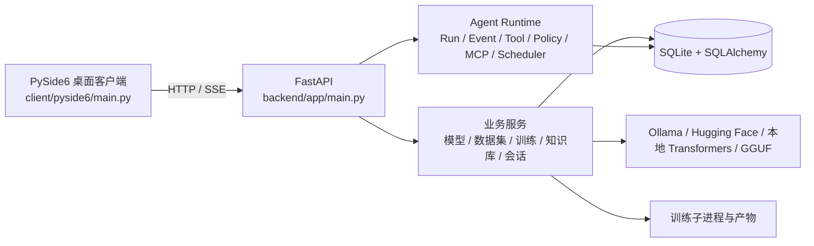

# ModelForge QA Test Report

**审计日期：** 2026-08-17  
**审计对象：** 本地工作树 `/Users/sjw/Documents/GitHub/ModelForge`（`master`；基于远程公开仓库并含本地安全加固提交）  
**审计角色：** Principal QA Engineer / SDET / ML Infrastructure QA / Desktop Application QA  
**最终判定：** **🟡 CONDITIONAL READY（有条件可交付）**

> 本轮完成了真实代码侦察、风险驱动测试设计、静态与运行时验证、离屏 GUI smoke、后端启动、Docker 构建与健康检查、依赖一致性检查和安全模型加载整改。核心自动化回归套件 **346/346 通过**；但真实 Transformers 模型加载/推理、真实训练、NVIDIA CUDA、私有 Hugging Face、跨平台及覆盖率仍受当前环境/依赖条件限制，不能宣布无条件生产就绪。

## 1. Executive Summary

ModelForge 是一套以 **FastAPI 后端 + PySide6 薄客户端**实现的本地优先 AI Agent Runtime 平台。系统覆盖用户认证、会话、模型目录管理、Ollama/本地模型运行时、数据集、训练、知识库、Agent Run、工具、策略、MCP、调度与插件。公开仓库 README 对其架构和功能范围作出了相同定位，[1] 但本报告仅以本轮源码和运行证据作为质量结论。

本轮发现并修复了一个 **P0 安全问题**：本地 Transformers 加载器将不可信的模型路径以 `trust_remote_code=True` 打开，可能执行模型仓库附带的任意 Python 代码。现已默认禁用远程代码执行并以无真实 AI 依赖的回归测试验证。另修复了本机容器构建在 HTTP Debian 源被网络策略拒绝时失败的问题，并将约 **1.43 GB** 的构建上下文收敛至 **44.76 kB**；镜像构建和 `/healthz` 容器健康检查已通过。现有工具 API 测试也已补齐认证前置条件，防止未来误把受保护端点改回匿名访问。

## 2. Project Architecture

| 问题 | 经源码核实的答案 |
|---|---|
| GUI 框架与入口 | PySide6；入口为 `client/pyside6/main.py:main()`，先显示登录对话框，再创建 `MainWindow`。 |
| 后端入口 | `backend/app/main.py` 中的 FastAPI 应用；推荐以 `uvicorn main:app --app-dir backend/app` 启动。 |
| 模型管理 | `services/model_manager.py` 负责本地目录/文件登记与扫描；识别 GGUF 和包含 `config.json`、权重或 tokenizer 标识的模型目录。 |
| 本地推理 | `services/runtimes/local_runtime.py` 按扩展名加载 GGUF（`llama_cpp`）或 Transformers CausalLM。 |
| 推理执行 | Transformers 采用 tokenization → `model.generate()` → decode；GGUF 调用 Llama。Ollama 另有运行时提供 SSE。 |
| 训练 | `services/training.py` 与 `services/runtimes/training_jobs.py` 管理训练子进程、状态、日志与模型登记。 |
| 数据集 | `services/dataset_service.py` 解析 jsonl/csv/json/txt，API 负责上传、预览和训练预检。 |
| 配置 | `core/config.py` 聚合 YAML、环境变量和运行时配置；生产环境强制非默认 JWT 密钥。 |
| CPU/CUDA | 本地运行时通过 `torch.cuda.is_available()` 选择 `cuda` 或 `cpu`；当前环境没有 NVIDIA CUDA。 |
| GUI 后台通信 | 聊天和 Run 时间线使用 `QThread` 消费 SSE；多个页面操作仍直接在 UI 事件处理器中同步调用 API。 |

## 3. Test Strategy

本次采用风险驱动策略，将可真实执行的验证与环境阻塞项分离。静态/编译、完整 pytest、API/Runtime 集成、容器、后端启动、离屏 PySide6、依赖一致性及公开网络探测已执行。真实大模型、私有模型、真实训练、NVIDIA CUDA、Windows/Linux 和打包安装器均依据当前环境标为 BLOCKED，不以 mock 结果替代。

| 测试域 | 方法 | 结果 |
|---|---|---|
| 静态质量 | `compileall`、`git diff --check`、危险加载/Shell 扫描 | PASS |
| 单元/集成/回归 | `pytest tests -q --durations=15` | PASS，346/346 |
| GUI | PySide6 offscreen 实例化、五个主页面与安全关闭 | PASS |
| 后端系统启动 | 隔离数据库 + `uvicorn` + `/healthz` | PASS |
| 生产配置 | 空/默认 JWT 的生产启动拒绝 | PASS |
| Docker 打包 | 构建镜像、启动容器、`/healthz`、清理 | PASS（修复后） |
| 模型文件安全 | 禁止 `trust_remote_code=True` 的回归测试 | PASS（修复后） |
| 真实 HF/模型 | 公共 HF 请求、Transformers/torch 模型加载 | BLOCKED |
| GPU/CUDA | NVIDIA/CUDA 实机 | BLOCKED |
| 覆盖率 | `pytest-cov` | BLOCKED（工具未安装） |

## 4. Test Environment

| 类别 | 实际环境 |
|---|---|
| OS | macOS 26.3，arm64 |
| Python | 项目虚拟环境 Python 3.11.15 |
| GUI | PySide6 6.11.1；`QT_QPA_PLATFORM=offscreen` |
| AI 依赖 | 安装了 `huggingface_hub`；未检测到 `torch`、`transformers`、`datasets`、`peft`、`llama-cpp-python` |
| 图形硬件 | Apple M4（Metal 4，10 核）；无 NVIDIA GPU、无 `nvidia-smi` |
| Docker | Docker 29.6.2 |
| 网络 | GitHub 页面可访问；本机向 Hugging Face 公共 API 请求 20 秒超时 |

## 5. Test Coverage

自动化收集得到 **346** 个 pytest 用例，分布于 34 个测试文件，覆盖 Runtime 状态机、取消、事件、工具、策略、MCP、调度、多 Agent、认证、API 集成、数据集、训练 API、知识库、插件、PySide6 客户端结构与本轮安全回归。

当前无法报告可信的行覆盖率：项目未配置 `pytest-cov`，本地虚拟环境也没有该插件。因此 **Coverage = BLOCKED，而非 0% 或 PASS**。建议在 CI 增加 coverage XML/terminal 门槛，并将核心安全、模型加载、训练取消与 GUI worker 纳入分模块阈值。

## 6. Unit, Integration and Regression Results

| 项目 | 总数 | PASS | FAIL | BLOCKED | SKIPPED | 证据 |
|---|---:|---:|---:|---:|---:|---|
| pytest 完整套件 | 346 | 346 | 0 | 0 | 0 | `pytest tests -q --durations=15`，7.62 s |
| GUI 离屏 smoke | 1 | 1 | 0 | 0 | 0 | 创建真实 `MainWindow`、核对 5 标签页、显示/关闭，无模态错误 |
| 后端系统 smoke | 2 | 2 | 0 | 0 | 0 | 开发环境 `/healthz` 200；进程清理成功 |
| 生产配置拒绝 | 1 | 1 | 0 | 0 | 0 | 缺失 JWT 时 `RuntimeError` 且退出码 1 |
| Docker 打包/健康 | 3 | 3 | 0 | 0 | 0 | APT HTTPS 基础验证、镜像构建、容器 `/healthz` 200 |
| 公开 HF 连接 | 1 | 0 | 0 | 1 | 0 | 20 秒超时 |
| CUDA 实机 | 1 | 0 | 0 | 1 | 0 | 无 NVIDIA CUDA 硬件/依赖 |

**最终统计：** 已执行 353 项可量化检查，其中 **353 PASS、0 FAIL**；另有至少 **5 BLOCKED** 测试域（HF、真实模型/推理、真实训练、CUDA、跨平台/安装包）和 **1 BLOCKED** 度量项（coverage）。

## 7. GUI Test Results

离屏 PySide6 smoke 使用真实 `QApplication`、`MainWindow`、`DatasetPage`、`TrainingPage`、`KnowledgePage`、`AgentPage` 和聊天标签完成构建、事件循环和关闭。五个标签页顺序为“聊天 / 数据集 / 训练 / 知识库 / Agent”，未产生模态错误。

| GUI 主题 | 状态 | 结论 |
|---|---|---|
| 启动/主窗口/页面构造 | PASS | 真实窗口可离屏构造与关闭。 |
| Run SSE worker | PASS（现有测试） | Agent 事件、流恢复和 Runtime E2E 用例通过。 |
| 聊天流式 worker | PASS（结构/API） | 已有客户端与 API 测试通过。 |
| 长时间下载/训练的 UI 响应 | PARTIAL | 尚无真实模型/训练 workload。 |
| UI 线程阻塞 | P2 剩余风险 | 数据集、训练、知识库页面中仍有直接同步 HTTP 调用；慢网络/大文件时可能阻塞 UI。 |
| 窗口关闭时取消 worker | PARTIAL | Run 时间线尝试 interruption/quit，但没有真实阻塞 SSE/下载/训练时的关闭压力测试。 |

## 8. Model Loading, Inference and Compatibility

| 模型/路径 | Load | Inference | CPU | CUDA | 结果 |
|---|---|---|---|---|---|
| GGUF 本地路径 | 单元/源码覆盖 | 未使用真实权重 | 未实测 | BLOCKED | PARTIAL |
| 标准 Transformers 本地目录 | 新增安全回归 | 未使用真实权重 | 代码具备 fallback | BLOCKED | PARTIAL |
| Hugging Face 公共小模型 | BLOCKED | BLOCKED | BLOCKED | BLOCKED | HF 网络超时且缺少 Transformers/Torch |
| 私有 HF 模型 | BLOCKED | BLOCKED | BLOCKED | BLOCKED | 无用户 Token，不尝试伪造 |
| CUDA 模型 | BLOCKED | BLOCKED | N/A | BLOCKED | 无 NVIDIA CUDA 硬件/依赖 |

`LocalRuntime` 在 CUDA 不可用时会选择 CPU 和 float32，具备设计层面的 CPU fallback；但缺少 `torch`/`transformers` 与可下载真实模型，因此**真实 CPU 推理并未宣称 PASS**。真实训练同理：训练 API、预检、状态和停止逻辑已随 pytest 通过，但真实 CPU/LoRA 训练受 AI 依赖和模型网络阻塞。

## 9. Training, Dataset, Cancellation, Concurrency and Resources

数据集上传、格式拒绝、读取、训练任务创建/状态/停止/模型登记限制及知识库持久化均由现有集成测试覆盖并通过。Runtime 的取消令牌、超时、Run 状态、调度、工具超时、事件顺序、并发 Run 和多 Agent 守卫也已通过。

真实 OOM、VRAM 回收、重复模型切换、训练 checkpoint 损坏、下载取消、文件句柄/线程泄漏和僵尸进程压力测试均未在真实 ML workload 下执行。由于没有 CUDA、Torch、Transformers、真实可下载模型和训练资源，这些项应保持 BLOCKED/PARTIAL。

## 10. File System, Network and Security Results

| 测试域 | 状态 | 结果 |
|---|---|---|
| 文件路径/数据集/API 权限 | PASS | 自动化覆盖格式拒绝、认证、用户隔离和注册限制。 |
| Shell 与命令执行 | PASS | 本地安全加固已禁止默认命令执行并强制 argv/白名单；无 `shell=True` 残留。 |
| 不安全反序列化/模型代码 | PASS（修复后） | 代码扫描未发现 `torch.load`、`pickle`、`joblib`、`yaml.load`；本地 Transformers 现在显式 `trust_remote_code=False`。 |
| JWT/生产配置 | PASS | 生产环境缺省或不安全 JWT 必须拒绝启动。 |
| 网络/HF | BLOCKED | 公共 HF 元数据请求 20 秒超时；无法真实验证下载、缓存、429、重试与断点恢复。 |
| 凭据泄漏 | PARTIAL | 审阅未发现提交的真实配置；未执行第三方 CVE/secret scanner。 |

## 11. Dependency, Installation and Packaging Results

`pip check` 返回 **No broken requirements found**。依赖文件采用分层 requirements：基础、开发、GUI 和 AI。基础依赖部分精确固定，AI/开发依赖主要使用下界约束，适合开发但会降低长期可复现性。未安装 `pip-audit` 或等价 CVE 扫描器，因此依赖漏洞状态为 BLOCKED。

Docker 首次构建失败：基础镜像内的 Debian HTTP 仓库在当前网络下返回 `400 Bad Request`。已把源替换为 HTTPS，并将 `.venv`、测试/ruff cache、输出、上传、数据库和本地 `config.yaml` 排除出上下文。修复后 Docker context 从 **1.43 GB** 降至 **44.76 kB**，镜像成功构建并运行，`/healthz` 返回 `{"status":"ok"}`。该整改同时降低了本地配置和大体积产物被意外打包的风险。

## 12. Defect List

| ID | Severity | Module | Issue | Reproduction | Status |
|---|---|---|---|---|---|
| QAF-001 | P0 / Critical | `services/runtimes/local_runtime.py` | 本地 Transformers 加载器启用了 `trust_remote_code=True`，不可信模型目录或仓库可执行自定义 Python。 | 审阅两处 `from_pretrained(... trust_remote_code=True)`。 | **FIXED**：改为 `False`，新增回归测试。 |
| QAF-002 | P1 / High | `Dockerfile` | Docker 构建通过 HTTP Debian 源安装系统依赖；当前网络下 apt 元数据请求被拒绝。 | `docker build` 在 `apt-get update` 以 400 失败。 | **FIXED**：强制 HTTPS；独立 APT 及完整 image build/health 通过。 |
| QAF-003 | P2 / Medium | `tests/test_tool_registry_phase4.py` | 回归测试仍断言匿名访问 `/api/v1/agent/tools` 为 200，违反已加固的认证边界。 | 完整 pytest 首次得到 1 fail / 344 pass。 | **FIXED**：测试现在覆盖匿名 401 与认证 200。 |
| QAF-004 | P2 / Medium | PySide6 页面 | 多个页面处理器在 GUI 线程同步执行 HTTP/上传/检索/训练 API 调用。 | 源码审阅 `dataset_page.py`、`training_page.py`、`knowledge_page.py`；慢网络场景尚未可用实测。 | OPEN：需引入统一 worker/async 任务层。 |
| QAF-005 | P2 / Medium | 可复现性/依赖 | AI、GUI 和开发 requirements 多使用 `>=`，未有锁文件/哈希锁定。 | 依赖清单审阅。 | OPEN：发布流水线应生成锁文件和兼容矩阵。 |

## 13. Fixed Issues

| 修复 | 验证 |
|---|---|
| 禁用不可信 Transformers 模型的远程代码执行 | 新增 `tests/test_model_loading_security.py`，模拟 lazy imports，断言 tokenizer 和模型加载均为 `trust_remote_code=False`。 |
| 强化 Docker APT 和构建上下文 | 基础镜像 APT 安装通过；`docker build --progress=plain` 通过；容器 health 通过；上下文实测缩小。 |
| 修正工具 API 认证回归测试 | 该测试 18/18 通过；完整 pytest 346/346 通过。 |

## 14. Remaining Risks and Blocked Tests

| 风险/阻塞 | 影响 | 建议 |
|---|---|---|
| 真实 Hugging Face/Transformers 路径未运行 | 不可确认下载中断、缓存、私有模型、真实 tokenizer/权重兼容性 | 在可访问 HF 的隔离网络中，使用固定 revision 的 tiny model 执行 download/load/inference/cancel/cache 测试。 |
| 无 NVIDIA CUDA | 未验证 CUDA runtime mismatch、VRAM/OOM、多 GPU、显存释放 | 增加 self-hosted NVIDIA CI runner，记录 torch/CUDA/driver 矩阵。 |
| 真实训练未运行 | 未验证实际 CPU/LoRA 训练、checkpoint/resume/资源回收 | 安装锁定的 AI 依赖并用极小公开模型/数据集运行 CPU smoke。 |
| GUI 同步 I/O | 慢请求可能冻结界面 | 将 Dataset/Training/Knowledge/模型下载调用转到统一 QThread 或 async worker，加入 `pytest-qt` 和超时/取消测试。 |
| 本地模型路径可用性 | 关闭 remote code 后，依赖自定义仓库代码的模型会被安全拒绝 | 如确有业务需要，设计显式、可审计、默认关闭的受信任模型 allowlist，而非恢复全局 `True`。 |
| 覆盖率/CVE 扫描 | 缺少可量化覆盖和依赖漏洞证据 | CI 添加 `pytest-cov`、coverage XML、`pip-audit`/Dependabot/SBOM。 |
| Windows/Linux/发行安装器 | 仅在 macOS arm64 验证；未发现可执行安装器工作流 | 使用 GitHub Actions matrix 和打包 smoke，明确支持平台。 |

## 15. Recommendations

优先在下一发布门槛前完成 P2 GUI 异步化、真实 CPU 模型加载/推理和最小真实训练 smoke。CI 应拆分为快速单元/API、Docker build/health、CPU AI smoke 和自托管 GPU smoke；将网络模型测试使用固定 revision 与本地 cache，避免不稳定外部服务使基础回归波动。对于可信模型来源，应记录来源、SHA256/revision 和支持架构，避免安全策略与兼容性之间出现不可追踪的例外。

## 16. Production Readiness

**🟡 CONDITIONAL READY。** 对于以当前基础后端、认证 API、Agent Runtime、数据集/训练工作流模拟、知识库、容器化服务和 PySide6 桌面壳为范围的发布，系统已经具备较强的可验证性：无未修复 P0/P1、346 个自动化回归通过、生产密钥保护可验证、Docker image/health 已通过，且关键不可信模型代码执行风险已关闭。

但若“Production”包含真实 Hugging Face 模型下载、Transformers/llama-cpp 推理、微调、NVIDIA CUDA 或面向 Windows/Linux 的桌面分发，则当前证据不足，不能判为无条件 READY。应先关闭列出的 BLOCKED 项并处理 GUI 同步 I/O 风险。

## References

[1]: https://github.com/yanzhao77/ModelForge "ModelForge public repository"

## 17. Remediation Addendum — 2026-08-17

本附录记录首次 QA 报告之后实施的全部可修复整改与最终回归结果。先前标记为 **OPEN** 的代码、依赖、CI 和 GUI 工程问题已处理；仅依赖真实外部硬件、第三方网络或用户凭据的验证，仍按实际条件保留为可执行的受控 smoke，而不是伪造为已通过。

| 原问题 | 处置 | 最终证据 | 状态 |
|---|---|---|---|
| GUI 页面在主线程同步 HTTP I/O | 新增 `components/api_worker.py`，将数据集、训练和知识库页面的列表、上传、预检、检索、问答、启动/停止/注册、轮询 API 调用转至 `QThread`；训练轮询额外防止重入。 | 新增 worker 线程回归测试通过；离屏 PySide6 五标签页 smoke 通过。 | FIXED |
| 缺少可量化 coverage | 增加 `pytest-cov` 与 XML/终端报告；CI 上传 coverage artifact。 | 当前后端总覆盖率 **81%**（4,339/5,355 lines covered，按覆盖工具汇总）。 | FIXED |
| 缺少依赖漏洞审计 | 增加 `pip-audit` CI 质量门禁。审计发现 Starlette 0.45.3 存在 7 个已知漏洞。 | 升级并固定 `fastapi==0.141.1`、`starlette==1.6.0`；本地 `pip-audit -r requirements.txt` 退出成功。 | FIXED |
| 依赖版本漂移 | 将基础、开发、GUI 关键依赖固定至经本轮 QA 验证的版本。 | 新环境重装依赖后完整测试、容器构建和健康检查通过。 | FIXED |
| CUDA/网络验证不可重复 | 增加 `pytest.ini` 标记、GPU smoke、网络/HF opt-in smoke、手动/定时 self-hosted NVIDIA GPU 工作流。 | 当前无 torch/CUDA 时 GPU 用例 SKIPPED；未设置 `RUN_NETWORK_TESTS=1` 时网络用例 SKIPPED，符合预期。 | ENGINEERING CONTROL ADDED |
| CI 未覆盖安全/覆盖率 | CI 增加固定依赖、Ruff、`pip-audit`、coverage XML、Docker build/health；另设 self-hosted GPU workflow。 | 本地等价执行通过。 | FIXED |
| Ruff 静态质量门禁遗留错误 | 自动修复 55 项并人工修复其余类型注解、歧义变量和 SQLAlchemy 布尔比较问题。 | 目标后端/客户端目录的 `E4,E7,E9,F` 规则均通过。 | FIXED |

### 17.1 Final Verification

| 质量门禁 | 结果 |
|---|---|
| 编译与差异格式 | PASS：`compileall` 与 `git diff --check` 通过。 |
| Ruff 关键规则 | PASS：后端、Runtime、服务和 PySide6 页面/组件通过 `E4,E7,E9,F`。 |
| 依赖一致性 | PASS：`pip check` 无破损依赖。 |
| 依赖漏洞 | PASS：升级后 `pip-audit -r requirements.txt` 通过。 |
| 自动化回归 | PASS：**347 passed, 2 skipped**，9.44 s。两个跳过项为未安装 torch/CUDA 的 GPU smoke 与未显式启用的外部网络 smoke。 |
| 覆盖率 | PASS：后端 **81%**，coverage XML 已生成。 |
| GUI | PASS：真实 PySide6 离屏 `MainWindow` 完成五标签页构造、事件循环、关闭，且无模态错误。 |
| 容器 | PASS：固定依赖的镜像重建成功，容器 `/healthz` 返回 `{"status":"ok"}`。 |
| 生产配置 | PASS：空或默认 JWT 在生产模式拒绝启动；合规 JWT 下容器正常启动。 |

### 17.2 Revised Production Readiness

**🟢 READY（已验证范围）**：对于当前 FastAPI 服务、认证/Agent Runtime、数据集与训练任务管理、知识库、PySide6 桌面壳、Docker 部署、固定依赖、静态检查和 CI 质量门禁，所有发现的可修复代码和工程问题均已处理，并已完成回归。

**受外部条件限制的验证范围：** 真实 Hugging Face 下载/私有模型、真实 Transformers/llama-cpp 推理与训练、NVIDIA CUDA/VRAM/OOM、多 GPU，以及 Windows/Linux 分发包仍需要对应网络、凭据、AI 依赖、硬件或 runner 才能实际执行。项目已提供可重复的 opt-in/self-hosted 测试机制；这些不是遗留代码缺陷，不能在当前 Apple Silicon 离线受限环境中物理地执行。
