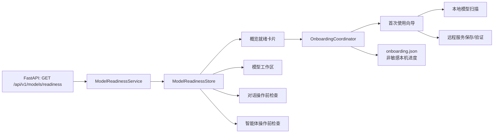

# ModelForge 技术开发计划

**版本：** 0.1（待产品确认）  
**交付中心：** PySide6 桌面客户端  
**计划范围：** P0 模型就绪状态与首次使用向导，以及 P1/P2 后续演进、质量门禁与测试版发布准备。

> 本计划以“让新用户在桌面端安全地完成模型配置、首次对话和后续 Agent 使用”为首要目标。它不以新增模块数量衡量完成度，而以用户能否理解状态、完成显式配置、恢复失败并获得可验证结果衡量完成度。

## 1. 项目基线与战略原则

ModelForge 采用 FastAPI 后端与 PySide6 桌面客户端架构，后端承载认证、模型、远程提供商、聊天、Agent Runtime、任务与数据业务，客户端负责多语言展示与交互。[1] 当前桌面端已有概览、对话、模型、数据集、训练、知识库、智能体、任务、运行时和设置工作区；本地模型与 OpenAI 兼容远程模型均应只在“模型”工作区集中管理。[1]

下一阶段遵循以下不可变原则：默认简体中文并支持英文、日文切换；远程服务继续以 OpenAI 兼容 `/v1/responses` 为优先、`/v1/chat/completions` 为兼容；API Key 仅在后端以加密形式保存，客户端不回显、不记录、不持久化；模型下载、训练、创建 Agent Run、重试或取消任务均须由用户显式发起。[1] [2]

| 原则 | 技术约束 | 验证方式 |
|---|---|---|
| 桌面端优先 | 不扩展现有 Web 原型，不复制远程提供商入口到设置页 | 代码评审与页面导航测试 |
| 后端权威 | 模型可用性、权限、默认模型和提供商验证摘要由后端产生 | API 契约与跨用户集成测试 |
| 非破坏性引导 | 向导只提供导航、扫描、保存、验证和选择；不隐式创建业务任务 | GUI 与 API 行为测试 |
| 安全最小化 | 快照、客户端缓存、日志与本机恢复文件均不得包含密钥、Token 或密文 | 响应字段、日志与文件扫描测试 |
| 一致体验 | 概览、模型、聊天和智能体共享同一模型就绪状态 | 离屏 GUI 集成测试 |

## 2. 现状、问题与目标架构

现有模型页可并行加载本地模型与远程提供商，提供商对话框支持保存、显式验证和删除；概览页目前只显示任务连接状态；现有 onboarding 接口只统计本地可用模型、会话和 Agent Run，不能反映远程模型能否真正使用。[2] [3] 因此核心问题是各页面对“是否已经可以开始对话或运行 Agent”的判断并不统一。

目标架构将“资源事实”和“体验进度”分开。后端 `ModelReadinessService` 生成不含密钥的事实快照；客户端 `ModelReadinessStore` 异步缓存并向所有工作区广播；`OnboardingCoordinator` 仅记录用户在本机是否关闭或恢复向导，不能伪造模型可用性。



## 3. P0：模型就绪状态与首次使用向导

### 3.1 领域模型与状态判定

客户端新增无 Qt 依赖的 `ReadinessSnapshot`、`ModelTarget`、`BlockingReason` 与 `ReadinessLevel`。页面不得再自行用“模型记录数量”推断可对话；所有操作前检查必须消费同一快照。

| 等级 | 判定条件 | 主 CTA | 用户可执行动作 |
|---|---|---|---|
| `READY` | 存在本地可用模型，或存在已验证、启用且密钥已配置的远程目标 | 前往对话或选择默认模型 | 开始对话、创建 Agent、切换默认模型 |
| `SETUP_REQUIRED` | 没有本地可用模型，也没有可用远程目标 | 配置模型 | 扫描已有本地模型或新建远程服务 |
| `DEGRADED` | 有配置记录，但密钥缺失、验证失败、默认目标失效或无可用模型 | 修复配置 | 编辑密钥、重新验证、更换默认模型 |
| `SERVICE_UNAVAILABLE` | 后端不可达、认证失效或就绪服务异常 | 重试或登录 | 检查服务、重新登录、刷新 |

推荐动作采用稳定枚举：`open_model_setup`、`configure_remote`、`scan_local`、`verify_provider`、`select_default`、`open_chat`、`reauthenticate` 和 `retry_service`。UI 根据枚举映射本地化文案，不直接展示后端自由文本。

### 3.2 后端数据与 API

新增只读端点 `GET /api/v1/models/readiness`。端点必须要求 JWT，只读取数据库与运行时信息，禁止触发外部请求、加载模型、下载模型或创建任务。快照永远不包含 API Key、密文、认证头、完整响应正文或外部服务敏感错误。

```json
{
  "schema_version": 1,
  "generated_at": "2026-08-21T03:30:00Z",
  "level": "SETUP_REQUIRED",
  "targets": [],
  "default_target": null,
  "blocking_reasons": [{
    "code": "NO_MODEL",
    "scope": "model_inventory",
    "action": "open_model_setup",
    "message_key": "readiness.no_model"
  }],
  "recommended_action": "open_model_setup"
}
```

`RemoteProviderConfig` 增加 `last_verified_at`、`verification_status`、`verification_error_code` 和有长度上限的 `verified_models_json`。现有 `POST /api/v1/providers/{id}/verify` 保持不变，但验证结果必须写入这些非敏感摘要；保存提供商时禁止自动触网。建议为单一用户/提供商验证设置每分钟 5 次的短窗口限流，避免误循环请求第三方服务。

新增用户级 `UserModelPreference`，保存 `default_kind`、`default_model_ref`、`default_provider_id` 与 `updated_at`。`PUT /api/v1/models/default` 只允许当前用户选择本地可用模型或已启用、密钥已配置且验证成功的远程模型；`DELETE /api/v1/models/default` 清空显式偏好。旧数据库以加法迁移处理，迁移必须保留已有提供商与密钥密文。

### 3.3 首次使用向导

向导在登录成功且就绪等级非 `READY` 时显示，每个向导 schema 版本最多自动弹出一次。用户关闭或选择“稍后处理”后 7 天内不再自动弹窗，但概览与模型页始终保留“继续配置”入口。进度存储在用户 ID 哈希命名空间下的 `onboarding.json`，仅保存 `schema_version`、`dismissed_at`、`last_step`、`last_path` 和 `last_seen_readiness_level`。

| 步骤 | 触发条件 | 显式用户动作 | 成功条件 |
|---|---|---|---|
| 评估 | 登录后或用户手动打开 | 重试、关闭 | 获取就绪快照或展示可恢复服务错误 |
| 选择路径 | `SETUP_REQUIRED` 或 `DEGRADED` | 使用本地模型、配置远程服务、稍后处理 | 用户选择路径；不创建任务 |
| 本地路径 | 用户选择本地 | 扫描目录、刷新、选择模型 | 找到并选择 `available` 模型；下载仅跳转模型页 |
| 远程路径 | 用户选择远程 | 填写名称、URL、协议、模型和密钥；保存后显式验证 | 验证成功，发现可选模型 |
| 选择默认 | 本地或远程存在可用目标 | 选择模型、设为默认 | 后端返回 `READY` 快照 |
| 完成 | 有默认目标 | 前往对话或停留概览 | 只导航，不创建会话或发送消息 |

### 3.4 桌面端组件与集成

| 模块 | 职责 | 集成位置 |
|---|---|---|
| `domain/model_readiness.py` | 不可变数据类型和 JSON 解析 | 新增纯 Python 模块 |
| `services/model_readiness_service.py` | API 调用、响应校验、异常映射 | 基于既有 `ModelForgeClient` |
| `components/model_readiness_store.py` | 30 秒缓存、单飞刷新、过期响应丢弃、状态信号 | 由 `MainWindow` 在认证后创建 |
| `components/readiness_banner.py` | 可本地化状态、说明和 CTA | 概览、模型、聊天、智能体共用 |
| `components/onboarding_coordinator.py` | 自动弹窗、关闭抑制、恢复和手动重开 | 连接 `RecoveryManager`/本机文件 |
| `components/onboarding_wizard.py` | 向导步骤、焦点管理、显式动作与安全清理 | 复用远程服务保存/验证能力 |

`WorkspacePage` 用就绪卡片替换静态“先在对话中选择模型”的提示。`ModelsPage` 以快照显示已验证/待验证/缺密钥与“设为默认”动作。`ChatPage` 自动预选默认目标；无就绪目标时禁用发送并打开引导。`AgentPage` 在创建或发起 Run 前验证目标；若模型失效，禁止操作并导航至配置入口。`SettingsPage` 仅增加“重新打开首次使用向导”和默认模型摘要，不重复放置远程提供商管理入口。

所有新增文本进入运行时本地化资源。P0 同时修正远程服务对话框的重复 `localize_tree` 调用和遗留英文表单标签，保证简体中文默认且中英日切换后无混合文案。

## 4. P1 与 P2 发展路线

| 阶段 | 工作包 | 主要结果 | 前置依赖 |
|---|---|---|---|
| P1-A | Agent 创建和运行闭环 | 模板可克隆、工具/权限摘要、审批策略预览、运行前检查与回放入口 | P0 `READY` 快照与默认模型 |
| P1-B | 远程模型可靠性 | 常用 OpenAI 兼容预设、协议回退建议、401/429/5xx 诊断、SSE 断线回归 | 提供商验证摘要与错误码 |
| P1-C | 质量与文档 | 独立桌面 CI job、客户端覆盖率报告、README/QA/版本统一 | P0 测试基线 |
| P2-A | 真实 CPU AI smoke | 固定 revision 小模型的下载、加载、推理与最小训练验证 | 锁定 AI 依赖与隔离缓存 |
| P2-B | GPU smoke | 接入标签为 `self-hosted`、`linux`、`nvidia-gpu` 的 Runner，维护 CUDA/Torch/驱动矩阵 | 真实 NVIDIA 硬件 |
| P2-C | 跨平台发行 | Windows/Linux 打包与安装后 smoke；macOS Developer ID 签名和公证 | 证书、各平台构建环境 |

## 5. 本周实施排期

本周目标是交付一个可合并的 P0 垂直切片，而不是只完成 UI 原型。每天结束应存在可独立运行的测试，避免后端迁移、状态 Store 与向导在最后一天同时集成。

| 日期 | 工作内容 | 主要文件 | 每日完成定义 |
|---|---|---|---|
| Day 1 | 建立 readiness 领域模型、服务真值表、用户偏好与提供商验证摘要迁移。 | `records.py`、迁移、readiness service、后端测试 | 四个等级、默认目标、跨用户边界有单元测试 |
| Day 2 | 实现 readiness/default API，升级提供商 verify 写入摘要，补齐权限、安全与限流测试。 | `api/models.py`、`api/providers.py`、service、API tests | 保存不触网；响应不含密钥或密文 |
| Day 3 | 实现桌面领域对象、API client、单飞刷新 Store 与概览/模型页状态展示。 | API client、store、`workspace_page.py`、`models_page.py` | 无模型 CTA 不进入空聊天；缓存和错误映射可测 |
| Day 4 | 实现向导、非敏感本机恢复、三语言和远程提供商流程复用。 | wizard/coordinator、`recovery.py`、i18n、`provider_dialog.py` | 关闭可恢复；密钥输入后清空；三语言无混合文本 |
| Day 5 | 接入聊天/智能体前置检查，完成离屏、Stub、CI、文档和发布准备验证。 | `chat_page.py`、`agent_page.py`、tests、CI、README/QA | 全部质量门禁通过；演示流程可重复 |

## 6. 测试、CI 与质量门禁

| 层级 | 核心场景 | 通过条件 |
|---|---|---|
| 后端单元 | 状态真值表、默认偏好、验证摘要和错误码映射 | 每个等级、阻塞原因与权限分支均有断言 |
| API 集成 | 401、跨用户拒绝、保存不触网、验证后更新、响应无密钥/密文 | FastAPI TestClient 全绿 |
| 迁移 | 旧 SQLite 数据库补列和读取 | 旧提供商配置不丢失 |
| 客户端单元 | 快照解析、缓存过期、单飞刷新、过期响应丢弃 | 使用 Fake API，不依赖网络 |
| PySide6 离屏 | 向导步骤、焦点、关闭/恢复、翻译、按钮禁用 | `QT_QPA_PLATFORM=offscreen` 下无模态错误与主线程 HTTP |
| 端到端 Stub | 无模型→保存→显式验证→选择默认→对话；失败→修复→成功 | 不创建 Agent Run、不下载模型、不写入客户端密钥 |
| 全量门禁 | Ruff、pip-audit、pytest、Docker health | 与现有 ModelForge CI 一致通过 |

CI 新增独立 `desktop` job，安装 GUI 依赖和 `libegl1`，设置 `QT_QPA_PLATFORM=offscreen`，并单独展示客户端测试结果。后端 job 继续负责 API、迁移与核心服务测试；Docker job 不引入 GUI 依赖。涉及 OpenAI 兼容协议和 SSE 的改动必须同步更新后端契约、Fake API 和桌面离屏测试。

## 7. P0 验收标准

| 编号 | 可验证标准 |
|---|---|
| AC-01 | 新用户无可用模型时显示 `SETUP_REQUIRED`，主 CTA 打开向导，不自动下载模型、创建会话、Agent 或任务。 |
| AC-02 | 缺密钥或未验证的远程服务使状态为 `DEGRADED`，不得成为聊天/Agent 可用目标。 |
| AC-03 | 用户显式保存、验证并选择模型后，readiness 返回 `READY` 和不含密钥的默认目标。 |
| AC-04 | 扫描、验证与快照刷新均在 worker 中执行，GUI 线程不直接请求 HTTP。 |
| AC-05 | 后端离线、会话失效、提供商 401/403/429、无效模型列表均提供可恢复反馈且不泄露敏感信息。 |
| AC-06 | 简体中文默认，切换英文/日文后向导、横幅、空状态、错误与按钮全部同步翻译。 |
| AC-07 | 现有任务 onboarding、模型、提供商、聊天、智能体和任务中心回归通过；新增契约、离屏和 Stub 测试纳入 CI。 |
| AC-08 | README、QA 报告、测试计数、Beta 限制与 Release 说明在同一交付中校准。 |

## 8. 风险、降级与发布策略

| 风险 | 处理方式 | 降级策略 |
|---|---|---|
| 用户偏好迁移复杂度高 | Day 1 先用旧库 fixture 验证加法迁移 | 临时仅存本机默认模型，但明确标记为过渡，不作为最终方案 |
| 远程服务协议差异 | 保持通用 OpenAI 兼容表单，以稳定错误码诊断 | 不为未验证服务宣称原生兼容；预设延后至 P1 |
| 向导重构导致翻译回归 | 单独测试本地化与焦点；复用既有对话框 | 向导先跳转独立提供商对话框，嵌入式体验延后 |
| GPU/AI 测试缺少硬件 | 保留 opt-in CPU/GPU smoke，不伪造通过 | 明确列为环境限制，等待自托管 NVIDIA Runner |
| macOS 发布可信度不足 | Beta 明确标示 arm64、测试用途与未公证状态 | 获得证书后再做 Developer ID 签名和公证 |

当 AC-01 至 AC-08 全部通过后，才允许发布或更新 `v0.1.1-beta.1` GitHub Pre-release。该 Release 应携带 macOS ZIP、`checksums.txt` 与测试说明，且明确其尚未完成跨平台发行、正式签名/公证和 GPU 硬件验证。

## 9. 当前待办与产品确认

当前 `todo.md` 已完成项目审查与 P0 设计，并保留五项 P0 实施任务：后端契约/迁移、API/安全测试、桌面 readiness Store、首次使用向导与三语言、聊天/智能体前置检查及全量验证。[4]

开始 Day 1 前需要确认以下选择：P0 是否只保留通用 OpenAI 兼容表单；默认模型是否采用用户级后端偏好；向导关闭后是否采用 7 天自动提示抑制；以及是否在 P0 验收通过后立即创建 `v0.1.1-beta.1` Pre-release。推荐答案分别为“是、是、是、是”。

## References

[1]: [项目 README 与桌面端功能基线](../README.md)

[2]: [P0 模型就绪状态与首次使用向导技术设计](P0_MODEL_READINESS_ONBOARDING_DESIGN.md)

[3]: [下一阶段优化与开发路线图](NEXT_PHASE_DEVELOPMENT_PLAN.md)

[4]: [当前本周待办](../todo.md)
